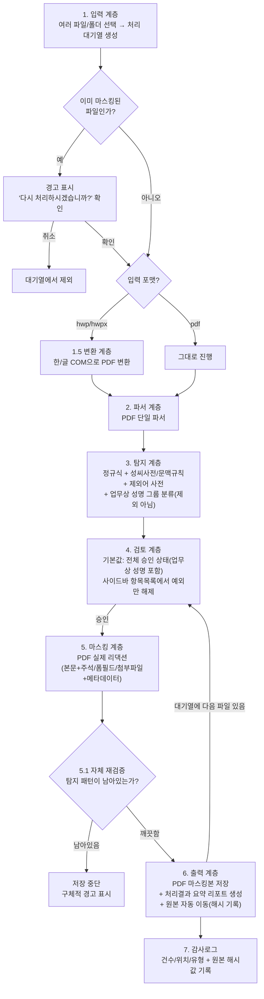

# 감사파일 개인정보 마스킹 자동화 — 아키텍처 설계서 (v14)

## 1. 배경 / 목표
감사실 담당자가 감사파일 내 개인정보를 수기로 하나씩 마스킹하는 비효율을 없애기 위한 도구.
전체 자동화가 아니라 **"자동 탐지·마스킹 + 사람의 최종 검토/승인"** 구조.

## 2. 범위
- **입력 파일**: hwp, hwpx, pdf
- **출력 파일**: **항상 PDF로 통일**
- **마스킹 대상 개인정보**: 주민등록번호/여권번호 등 식별번호, 이름, 전화번호/이메일/주소, 계좌번호/카드번호
- **사용자**: 감사실 내 소수 인원 (1~수명)
- **운영 형태**: 개인/비공식 프로젝트, IT/서버 인프라 지원 없음
- **개발 주체**: 감사실 인턴 개인 프로젝트
- 스캔 이미지 PDF는 1차 범위 밖 (OCR은 2단계에서 추가 검토)

### 2.1 개발·배포 선행 조건 (인턴 개인 프로젝트 특성상 반드시 지킬 순서)
1. **개발/테스트 단계에서는 실제 감사파일을 절대 사용하지 않음** — 실제 파일과 동일한 형식(hwp/hwpx/pdf, 표 구조 등)을 모방한 **더미 데이터**(가짜 이름·주민번호·연락처)로만 개발/검증
2. 도구가 어느 정도 완성되면 **프로토타입으로 시연** — 이 시점 전까지는 실제 업무에 투입하지 않음

## 3. 핵심 설계 변경 이력
- **v1 → v2**: hwp/hwpx/pdf 3종 파서를 각각 만드는 대신, hwp/hwpx는 PDF로 변환 후 **PDF 엔진 하나로 통일** 처리. 결과물은 항상 PDF (편집용이 아닌 최종/보관용이므로 감수).
- **v2 → v3**: "기술적으로 맞는 설계"에서 "감사실에서 매일 써도 편한 설계"로 보강. 검토 속도, 탐지 정확도, 재처리 유연성, 사후 증빙 자료까지 고려.
- **v3 → v4**: 편의 기능보다 **"마스킹의 기술적 정확성"을 최우선 요구사항으로 승격**. 저장 전 자체 재검증, 숨겨진 콘텐츠(주석/폼필드/첨부파일) 검사, 메타데이터 제거, 처리 원자성을 필수 항목으로 추가.
- **v4 → v5**: 기능/편리성/보안성 3축으로 최종 자체 점검. 실행취소(Undo), 자체검증 실패 후 후속 흐름, 임시파일 전반 삭제 원칙, 오류 메시지의 개인정보 비노출을 필수 항목으로 보강. 진행률 표시·이력 조회 UI는 향후 확장으로 분류.
- **v5 → v6**: "업무상 성명(결재선 등)은 마스킹 안 해도 된다"는 가정을 재검토. 실제 관찰상 관계부서 담당자 등도 마스킹되는 경우가 있어, 시스템이 임의로 제외하지 않고 **그룹만 나눠 보여주되 기본값은 마스킹 대상(체크됨)**으로 정책 수정 — 판단 근거가 불확실할 땐 더 안전한 쪽(가리는 쪽)을 기본값으로 함.
- **v6 → v7**: 문서 전체를 같은 기준("확인 안 된 가정을 사실처럼 적어놓은 곳 없는지")으로 재점검. **주소 탐지 방법 누락**(실제 설계 구멍)과 **로그 처리자 식별 방법 미정**을 보완하고, hwp 변환 실패 케이스(매크로 경고/파일 잠금/충돌)를 리스크에 추가. 마스킹 형태(부분/완전) 등 여전히 미확인인 가정들은 "9. 실사용 전 반드시 확인해야 할 가정" 섹션으로 별도 정리.
- **v7 → v8**: **결과물 파일명 자체에 개인정보가 남는 문제**를 발견해 수정 — `원본파일명_마스킹.pdf` 대신 `[문서유형]_[처리일자]_[일련번호].pdf` 형식으로 변경(문서유형은 검토 단계에서 사람이 직접 선택). 이에 따라 재실행 방지 판별 기준도 파일명이 아닌 폴더 경로+비개인정보 마커 기준으로 함께 수정.
- **v8 → v9**: 잔여 보완 사항 반영 — 주민번호/여권번호 정규식·마스킹 표기를 형식에 맞게 분리, 자체 재검증이 "리댁션 실패"만 잡고 "탐지 실패"는 못 잡는다는 한계를 명시, 재검증 실패 시 "재시도"가 구조적 원인엔 무의미할 수 있음을 명시, 문서 내 버전 라벨 오타 수정.
- **v9 → v10**: 더미 데이터로 핵심 파이프라인(탐지→리댁션→재검증→메타데이터 제거)을 실제로 구현·실행해 프로토타입 검증(7.1). "실제 리댁션이 PDF 바이트 레벨에서 완전히 제거된다"는 핵심 주장을 실측으로 증명. 동시에 **회전된 텍스트에서 탐지·재검증이 모두 통과 못 시키는 실패 사례를 실제로 재현**해, 6.5.1에 회전 텍스트 경고 완화책을 추가.
- **v10 → v11**: 부분마스킹(이름/전화번호)이 리댁션+텍스트 재삽입 방식으로 실제로 가능한지 추가 실측 — 좌표까지 확인해 시각적으로 정상 렌더링됨을 증명. 다만 재추출 시 정렬 옵션(`sort=True`) 없이는 추출 순서가 흐트러질 수 있음을 발견해 자체 재검증 로직에 반영.
- **v11 → v12**: PoC 결과를 토대로 "성공 기준 정의 → 엔지니어링 요약 → 기준 대비 평가 → 진행 여부 결정"의 타당성 평가를 12번 섹션으로 추가. 결론은 진행(GO)이되, "완전 자동화된 궁극의 솔루션"이 아니라 "사람의 최종 검토를 전제로 안전성을 기술로 보강한 보조 도구"임을 명확히 함.
- **v12 → v13**: MVP 범위를 6번 섹션의 출력 계층(6.4/6.6/6.7/6.8)까지 확장 구현하고, 그 결과로 12.3의 "⚠️ 미검증" 항목들을 실측으로 재평가함(12.5 신규). 구체적으로 (1) 파일명 규칙/폴더 구조/원본 해시/감사로그/요약리포트/재실행 방지 마커/처리자 식별을 실제 코드로 구현(`mvp/output.py`), 문서 유형 선택 UI 추가, (2) Linux 환경에서 PyInstaller 단일 실행파일 빌드를 실제로 수행해 패키징 메커니즘(의존성·데이터파일 번들링)을 실측 검증, (3) 이름/주소 탐지의 정밀도/재현율을 12개 시나리오 더미 코퍼스로 실측(`mvp/evaluate_detection_accuracy.py`) — 이 과정에서 지역명이 다른 단어의 부분 문자열로 들어있을 때(예: "해운대구" 안의 "대구") 주소로 오탐하는 실제 버그를 발견해 수정함, (4) 자동화 구간(탐지~로그~리포트) 처리 시간을 실측해 도구 자체는 병목이 아님을 확인. hwp 실제 변환과 Windows용 .exe 최종 빌드는 이 세션 환경(Linux, 한컴오피스 없음)의 근본적 한계로 여전히 미검증.
- **v13 → v14**: v13에서 구현한 출력 폴더 위치가 "입력 파일이 있는 폴더 기준"으로 잘못 만들어져 있던 걸 발견해 수정 — 원래 6.6의 폴더 구조 그림은 어떤 폴더의 파일을 처리하든 결과가 **프로그램(.exe) 옆 한 곳에 고정**되는 설계였는데, 구현이 입력 파일마다 폴더가 따로 생기는 구조로 벗어나 있었음(감사로그가 폴더별로 흩어지는 문제). `output.app_base_dir()`을 추가해 PyInstaller로 패키징된 실행 시에는 `sys.executable` 기준, 일반 스크립트 실행 시에는 스크립트 파일 위치 기준으로 통일 — 입력 파일 위치와 무관하게 항상 프로그램 옆 한 곳에 결과가 모이도록 수정하고 Linux 빌드로 재검증함.

## 4. 실행 환경 결정
- **로컬 Windows 데스크톱 프로그램**, 서버 없음
- 담당자 PC에 한컴오피스(한/글) 설치됨을 전제 → hwp/hwpx → PDF 변환에 필요
- 배포: PyInstaller로 패키징한 **단일 .exe**, 파이썬 설치 불필요
- UI: **로컬 데스크톱 창 (PySide6/Qt)**

## 5. 전체 아키텍처



> 5→6 사이의 자체 재검증(5.1)을 통과하지 못하면 어떤 파일도 `마스킹완료/`나 `원본_보관/`으로 이동하지 않음 — 실패는 항상 "아무 일도 안 일어난 상태"로 귀결.

## 6. 계층별 상세 설계

### 6.1 변환 계층 (hwp/hwpx → PDF)
- `pywin32`로 한/글 COM을 열어 "다른 이름으로 저장 → PDF" 호출
- 변환 성공 여부만 검증하면 되므로 구현·테스트 범위가 작음
- Windows + 한컴오피스 설치 환경에서만 실행/검증 가능
- **변환 실패 케이스 처리 (신규)**: 아래 상황은 변환이 안 되거나 예상과 다르게 동작할 수 있어 명시적으로 감지하고 안내해야 함
  - 매크로 보안 경고창이 뜨는 hwp (자동화 호출이 막힘)
  - 비밀번호로 잠긴 hwp
  - 사용자가 이미 한/글을 열어둔 상태에서 자동화 호출 시 충돌
  - 손상되었거나 지원하지 않는 버전의 hwp 파일
  - 위 경우 모두 **원본은 그대로 두고, 해당 파일만 대기열에서 실패 처리 + 구체적인 실패 사유를 사용자에게 표시** (전체 배치가 멈추지 않도록)

### 6.2 파서 / 탐지 계층 (PDF 단일 경로)
- `PyMuPDF(fitz)`로 텍스트와 좌표 추출, 표 내부 텍스트도 동일 경로로 처리
- 전화번호/이메일/계좌번호/주민등록번호: **정규식** 기반 (주민등록번호는 체크섬 규칙까지 적용해 오탐 축소)
- **여권번호**: 주민등록번호와 형식이 완전히 다름(영문자 1자 + 숫자 8자) → 별도의 정규식 패턴 필요, 같은 "식별번호"로 뭉뚱그려 하나의 패턴으로 처리하지 않도록 주의
- 이름: **성씨 사전 + 문맥 규칙**("성명:", "담당:" 등 라벨 뒤 텍스트)으로 1차 탐지
- **주소 (설계 누락 보완, 신규)**: 주소는 전화번호/계좌번호처럼 고정된 패턴이 없어 정규식만으로 탐지 불가 → **행정구역 사전(시/도·시/군/구 명칭 목록) 매칭 + "주소:", "거주지:" 라벨 문맥 규칙**을 조합해 탐지. 이름과 마찬가지로 오탐/누락 가능성이 상대적으로 높은 항목이라 검토 단계 의존도가 큼
- **제외어 사전**: 부서명/직책명/회사명처럼 성씨로 오인되기 쉬운 흔한 단어 목록을 별도로 관리해 오탐 축소 (직원 명부 없이도 구축 가능)
- **업무상 성명 그룹 분류 (v6에서 정책 수정)**: "직위+이름"("감사팀장 홍길동") 패턴, 문서 상/하단 결재란 위치의 이름은 별도 그룹("업무상 성명 후보")으로 나눠서 보여줌 — 단, **자동 제외는 하지 않고 기본값은 다른 항목과 동일하게 "마스킹 대상(체크됨)"**. "공무 수행 중 성명은 통상 마스킹 안 해도 된다"는 게 일반론일 뿐 감사실의 실제 마스킹 기준과 다를 수 있다는 걸 확인했기 때문 — 관계부서 담당자처럼 결재선이 아니어도 문서에 등장하는 인물은 마스킹 대상일 수 있음. 그룹으로 나누는 이유는 어디까지나 "검토자가 한 번에 훑어보고 판단하기 쉽게" 하기 위함이지, 안전 쪽 판단을 시스템이 대신하지 않기 위함
- 향후 정확도가 부족하면 한국어 NER 모델(로컬 추론) 추가를 2단계 개선 항목으로 남겨둠

### 6.3 검토 계층 (UI)
- **기본값은 "전체 승인" 상태**: 탐지된 항목은 모두 마스킹 예정으로 미리 체크되어 있고, 검토자는 **틀린 것만 클릭해서 해제**하면 됨 (건별로 일일이 확인/추가하는 방식보다 훨씬 빠름)
- 사이드바에 탐지 항목 목록("이름 3건, 전화번호 1건...")을 유형별로 표시, 클릭하면 해당 위치로 자동 이동
- **"업무상 성명" 그룹도 다른 항목과 동일하게 기본 마스킹 대상(체크됨)** — 화면에서 그룹만 나눠 보여줘서 검토자가 한 번에 판단하기 쉽게 할 뿐, 시스템이 미리 판단해서 빼주지 않음 (안전한 기본값: 확실하지 않으면 가림)
- 키보드 단축키(다음 항목, 포함/제외 토글, 전체 승인)로 반복 작업 속도 향상
- 모든 항목 확정 후 "승인" 버튼으로 다음 단계(실제 마스킹) 진행
- **문서 유형 선택 (신규)**: 승인 전, 결과 파일명에 쓸 **문서 유형**을 드롭다운에서 한 번 선택(예: 지출결의서/출장/민원/계약/기타) — 6.6에서 파일명을 안전하게 만드는 데 사용
- **다중 파일 지원**: 여러 파일을 한 번에 선택하면 처리 대기열이 만들어지고, 검토 화면에서 파일 단위로 하나씩 넘기며 확인 (배치 자동 처리는 아님 — 파일마다 사람이 검토)
- **실행취소(Undo/Redo)**: 항목 추가/해제, 전체승인/전체해제 같은 검토 조작은 모두 되돌릴 수 있어야 함 (`Ctrl+Z` 등). 승인 전 단계는 아직 파일에 손을 대지 않은 상태이므로 자유롭게 되돌릴 수 있음

### 6.4 재실행(중복 마스킹) 방지
- 이미 마스킹된 파일인지는 **① `마스킹완료/` 폴더 경로** 또는 **② PDF 안에 남겨둔 처리완료 표시(비-개인정보 마커, 예: 문서 속성에 `MaskingTool-Processed: true` 같은 값)**로 감지 (v8부터 파일명이 `_마스킹` 접미사가 아닌 `[문서유형]_[날짜]_[일련번호]` 형식으로 바뀌어 파일명 기반 감지는 더 이상 신뢰할 수 없음)
- 감지 시 경고 표시 후 **"다시 처리하시겠습니까?" 확인**을 거쳐야 진행 (완전 차단이 아님 — 마스킹 정책 변경 등으로 재작업이 필요한 실무 상황을 막지 않음)
- **(v13 구현)** 마커는 PDF 표준 메타데이터의 `Keywords` 필드에 `MaskingTool-Processed:true`로 기록. 메타데이터 제거(6.5.1-3)가 값을 지운 **직후**에 다시 써넣어야 하므로, 저장 순서는 "리댁션 → 자체 재검증 → 메타데이터 전체 비우기 → 처리완료 마커 기록"이어야 함 (순서가 바뀌면 마커까지 지워짐)

### 6.5 마스킹 계층
- `PyMuPDF(fitz)`의 **실제 리댁션 API** 사용 (텍스트 레이어 자체 제거) — 단순 검은 박스 오버레이 금지
- **탐지된 개인정보만 텍스트를 지우고, 나머지 본문은 실제 텍스트 레이어로 그대로 유지** — 마스킹된 PDF에서도 개인정보를 제외한 내용은 복사/붙여넣기 및 텍스트 검색이 정상 동작해야 함 (문서 전체를 이미지로 평탄화하는 방식은 이 요구사항 때문에 배제)
- 항목별로 마스킹 형태를 다르게 적용:

| 항목 | 형태 | 예 |
|---|---|---|
| 이름 | 부분마스킹 | 홍*동 |
| 전화번호 | 부분마스킹 | 010-****-5678 |
| 이메일 | 부분마스킹 | ab***@domain.com |
| 주민등록번호 | 완전마스킹 | ******-******* (길이·하이픈 유지, 생년월일 포함 전부 마스킹) |
| 여권번호 | 완전마스킹 | ********* (길이 유지) |
| 계좌번호/카드번호 | 완전마스킹 | **-***-****** |

### 6.5.1 마스킹 정확성 보장 (필수) — "지워졌다고 표시되면 진짜 지워진 것"

검토 UX나 부가 기능보다 우선하는 요구사항. 아래 네 가지 없이는 저장을 완료 처리하지 않음.

1. **저장 전 자체 재검증(Self-check)**
   - 리댁션을 적용한 직후, 결과 PDF에서 텍스트를 **다시 추출**해 검토자가 승인했던 탐지 패턴(정규식/문자열)이 하나라도 남아있는지 재검사
   - **(PoC 실측) 텍스트 재추출 시 반드시 정렬 옵션(예: PyMuPDF의 `sort=True`)을 사용**: 부분마스킹으로 텍스트를 재삽입한 뒤 기본 옵션으로 추출하면 시각적 위치는 정확해도(렌더링은 정상) 추출 순서가 뒤섞여 나올 수 있음을 실측으로 확인 — 탐지·재검증 양쪽 모두 정렬 옵션을 일관되게 써야 오탐/누락 없이 신뢰할 수 있음
   - 하나라도 검출되면 **저장을 중단**하고 "N건이 완전히 지워지지 않았습니다"라고 구체적으로 경고 (회전된 텍스트, 특정 폰트 인코딩, 겹친 텍스트박스 등에서 리댁션 API가 실패하는 케이스를 잡아냄)
   - 재검증을 통과한 파일만 `마스킹완료/`로 최종 이동
   - **실패 후 후속 흐름**: 저장을 막는 것으로 끝나지 않고, 검토 화면으로 자동 복귀해 **남아있는 패턴의 위치를 별도로 하이라이트**해서 보여줌. 회전된 텍스트/폰트 인코딩처럼 **구조적 원인인 경우 같은 방식으로 재시도해도 다시 실패할 수 있음** — 무한 재시도를 유도하지 말고, 해당 페이지만 이미지로 변환 후 마스킹하는 대체 경로(최후 수단)를 제공하거나 파일명/페이지/패턴 유형을 안내해 개발자에게 보고하도록 함
   - **⚠️ 이 재검증이 잡아내는 것은 "리댁션 실패"이지 "탐지 실패"가 아님**: 재검증은 검토자가 승인했던 패턴이 잘 지워졌는지만 확인함. 애초에 탐지 엔진이 어떤 개인정보를 찾아내지 못했다면(예: 이름 탐지 누락) 재검증에도 걸리지 않고 그대로 통과함 — **"자체 재검증 통과"가 "이 문서에 개인정보가 하나도 안 남았다"는 보장은 아니라는 점을 UI 문구에서도 정확히 표현**해야 함 (예: "지운 항목은 확실히 지워졌습니다" ≠ "이 문서엔 개인정보가 없습니다")

2. **숨겨진 콘텐츠 검사**
   - 본문 텍스트 레이어 외에 **주석(annotation), 폼필드(form field), 첨부파일(embedded file), 선택적 콘텐츠 레이어(OCG)**에도 원본 텍스트가 남아있을 수 있음 → 이 영역들도 스캔 대상에 포함하고, PII 패턴이 발견되면 함께 제거하거나 검토자에게 별도 경고
   - hwp→PDF 변환 시 원본 hwp의 "숨은설명/메모"가 PDF 주석으로 옮겨지는 경우가 있어 특히 주의 필요

3. **문서 메타데이터 제거**
   - PDF 문서 속성(작성자, 마지막 수정자, 회사명 등 Info dictionary + XMP 메타데이터)에 개인정보가 남을 수 있음 → 저장 시 메타데이터를 함께 비움
   - hwp→PDF 변환 과정에서 한/글 계정 정보가 작성자로 남는 경우가 흔하므로 특히 확인 필요

4. **회전/비정상 배치 텍스트 경고 (프로토타입 실측으로 발견, 신규)**
   - PoC 테스트에서 회전된 텍스트가 추출 과정에서 원문 그대로 잘리는 현상을 실제로 재현함 → 정규식이 매칭 못 해 애초에 탐지 후보에도 안 오르고, 탐지가 안 됐으니 자체 재검증도 "확인할 대상 자체가 없어" 그냥 통과해버림 (거짓 안전)
   - 완화책: `get_text("dict")`로 각 텍스트 블록의 방향(`dir`)을 확인하면 **내용은 못 믿어도 "회전된 텍스트가 존재한다"는 사실 자체는 감지 가능**함이 실측으로 확인됨 → 문서에 회전된 텍스트 블록이 하나라도 있으면 검토 화면에 "이 문서에 회전된 텍스트가 있습니다. 자동 탐지가 놓쳤을 수 있으니 육안으로 다시 확인하세요"라고 경고 표시

### 6.5.2 처리 원자성 (트랜잭션 안전)
- "마스킹본 저장 → 자체 재검증 → 원본 이동 → 로그 기록" 순서를 하나의 단위로 취급
- 중간 임시 파일에 먼저 쓰고, **재검증까지 통과한 뒤에만** 최종 위치로 이동 + 원본 이동 + 로그 기록을 수행
- 어느 단계에서든 실패하면 이미 만들어진 임시 파일을 정리하고 **원본은 손대지 않은 상태로 되돌림** — "일부만 처리된 애매한 상태"가 남지 않도록 함
- **임시 파일 전반의 삭제 원칙**: hwp→PDF 변환본뿐 아니라, 처리 과정에서 생기는 모든 중간 산출물(재검증용 임시 추출 텍스트, 미리보기 캐시 등)은 예외 없이 처리 종료 시점(성공/실패 불문)에 정리. OS 임시폴더에 개인정보가 포함된 파일이 남지 않도록 하는 것이 원칙

### 6.5.3 오류 처리 시 개인정보 비노출
- 처리 중 오류가 나면 화면 메시지·로그·예외 스택트레이스 어디에도 **문서의 실제 텍스트 내용은 포함하지 않음** (파일명, 페이지 번호, 오류 유형까지만 노출)
- 개발/디버깅 목적이라도 원문 텍스트를 로그 파일에 남기는 임시 디버그 코드는 배포 빌드에서 제거

### 6.6 출력 / 원본 보관
- 마스킹본: 자체 재검증을 통과한 파일만 `마스킹완료/` 폴더에 **PDF로** 저장
- **파일명 규칙 (v8에서 안전하게 수정)**: `원본파일명_마스킹.pdf`는 원본 파일명 자체에 개인정보가 있으면(예: `홍길동_민원처리결과.hwp`) 그 정보가 결과 파일명에 그대로 남는 문제가 있었음 → **`[문서유형]_[처리일자]_[일련번호].pdf`** 형식으로 변경 (예: `민원처리_20260730_001.pdf`). 문서유형은 검토 화면(6.3)에서 검토자가 직접 선택한 값을 사용해 자동탐지 실패 리스크를 피함
- **원본 파일명과의 매핑**: 실제로 어떤 원본에서 나온 결과물인지는 파일명만으론 알 수 없으므로, 로그(6.7)와 요약 리포트(6.8)에 원본 파일명을 남겨 도구 안에서 조회 가능하게 함 (향후 확장 예정인 "처리 이력 조회 UI"와 연결)
- 원본: 처리 완료 시 **자동으로 `원본_보관/` 폴더로 이동** (삭제하지 않음)
- 변환 중간 산출물(hwp→pdf 변환본)은 임시 폴더에서 처리 후 삭제
- (권고) `원본_보관/` 폴더 자체는 회사 IT 정책에 맞춰 접근 제한 또는 암호화 보관을 권장 — 이 도구가 직접 강제하기보다 운영 가이드로 안내

폴더 구조 예시:
```
감사파일마스킹/
├── MaskingTool.exe
├── 원본_보관/
├── 마스킹완료/   (모두 .pdf)
├── 요약리포트/
└── 로그/
```
- **폴더 기준 위치 (v14에서 명확화)**: 위 4개 폴더는 처리하는 **입력 파일이 어디 있든 상관없이 항상 `MaskingTool.exe`(프로그램 자신) 옆 한 곳**에 고정됨 — 오늘은 `C:\문서\3월치\` 안의 파일을, 내일은 `D:\백업\민원\` 안의 파일을 처리해도 결과는 매번 같은 위치에 쌓여서 감사로그를 한 파일로 계속 관리할 수 있음 (`mvp/output.py`의 `app_base_dir()`)

### 6.7 감사 로그
- **건수/위치/유형만 기록**, 실제 개인정보 값은 로그에 남기지 않음
- **원본 파일 SHA-256 해시값 기록 (신규)**: 원본을 `원본_보관/`으로 이동할 때 해시를 같이 남겨, 나중에 "이 로그가 정말 이 원본에 대한 처리 기록인지" 위변조 여부를 검증할 수 있게 함. 구현 비용은 낮고(표준 해시 함수 호출 한 줄) 감사부서 특성상 효용은 큼
- **처리자 식별 방법 (v13에서 구현 확정)**: 두 대안을 모두 살려 결합 — 로그 폴더에 저장된 처리자 이름이 있으면 그대로 사용, 없으면 **최초 1회** Windows 로그인 계정명을 기본값으로 보여주는 입력창을 띄워 확인/수정받고 로컬(`로그/.processor_name`)에 저장, 이후 실행부터는 재입력 없이 자동 사용. 계정명이 실명이 아닌 공용 계정 환경도, 매번 물어보지 않는 편의성도 함께 만족
- 예: `2026-07-30 14:02 | 원본: 지출결의서_홍길동_3월.hwp (sha256:ab12...) | 이름 2건, 전화번호 1건 마스킹 → 결과물: 지출결의서_20260730_001.pdf | 처리자: OOO`
- 로컬 CSV 또는 SQLite로 저장

### 6.8 처리 결과 요약 리포트 (신규)
- 파일 마스킹 완료 시, 사람이 읽기 좋은 **1장짜리 요약본**을 `요약리포트/`에 같이 생성
- 내용: 원본 파일명, 처리일시, 처리자, 마스킹 유형별 건수, 결과물 파일명
- 용도: "이 문서 왜 이렇게 마스킹됐어요?"라는 질문에 로그를 뒤지지 않고 바로 첨부 가능한 증빙 자료

## 7. 결정된 정책 요약
| 항목 | 결정 |
|---|---|
| 출력 포맷 | 입력 포맷 무관, **항상 PDF로 통일** |
| 마스킹 형태 | 항목별 차등 (이름/연락처는 부분, 식별번호/계좌는 완전) |
| 원본 보관 | 자동으로 별도 폴더 이동 + SHA-256 해시 기록, 삭제 안 함 |
| 로그 수준 | 건수/위치/유형 + 원본 해시, 실값 미기록 |
| 검토 방식 | **기본 전체 승인 + 예외만 해제**, 사이드바 항목목록 + 단축키 |
| 성명 처리 | "업무상 성명"(직위+이름/결재선)은 그룹만 분리, **기본 마스킹 대상은 동일** (자동 제외 안 함) |
| 오탐 축소 | 성씨사전 + 제외어 사전(부서/직책/회사명) 병행 |
| 처리 트리거 | 도구 실행 후 파일/폴더 수동 선택 |
| UI 형태 | 로컬 데스크톱 창 (PySide6) |
| 배포 형태 | PyInstaller 단일 .exe |
| 스캔 이미지 PDF | 1차 범위 제외 (OCR은 2단계에서 추가) |
| 배치 처리 | 여러 파일 선택 → 대기열 생성 → 파일 단위 순차 검토 |
| 재실행 방지 | 경고 + 확인 절차 후 재처리 허용 (완전 차단 아님) |
| 결과 증빙 | 처리 결과 요약 리포트 자동 생성 |
| **마스킹 정확성** | **저장 전 자체 재검증 필수** — 본문 재추출 + 주석/폼필드/첨부파일 스캔 + 메타데이터 제거, 미통과 시 저장 자체를 차단 |
| 처리 원자성 | 임시 파일 → 재검증 통과 후에만 최종 이동, 실패 시 원본 무변경 롤백 |
| 검토 실수 방지 | 검토 화면 전 조작 실행취소(Undo/Redo) 지원 |
| 재검증 실패 대응 | 저장 차단 + 검토 화면 복귀, 남은 패턴 위치를 별도 하이라이트 |
| 임시 파일 처리 | 모든 중간 산출물을 성공/실패 불문 처리 종료 시 정리 |
| 오류 메시지 | 화면/로그/스택트레이스 어디에도 문서 원문 텍스트 미노출 |
| **결과물 파일명** | `[문서유형]_[처리일자]_[일련번호].pdf` — 원본 파일명에 개인정보가 있어도 결과물 파일명엔 남지 않음, 원본명은 로그/요약리포트로만 조회 |
| 재실행 방지 판별 기준 | 파일명이 아닌 폴더 경로 + PDF 내 비-개인정보 마커로 판별 |
| 회전 텍스트 경고 | 회전된 텍스트 블록 존재 시 검토 화면에 육안 재확인 경고 표시 |
| 처리자 식별 (v13 확정) | 로컬 저장값 우선 사용, 없으면 최초 1회 Windows 계정명 기본값으로 입력창에서 확인/수정 후 저장 |
| 문서 유형 선택 (v13 구현) | 검토 화면 드롭다운(지출결의서/출장/민원/계약/기타)에서 선택, 파일명 규칙에 사용 |

## 7.1 프로토타입 실측 검증 (v9~v10, PoC)

말로만 된 설계인지 확인하기 위해, 더미 데이터(가짜 이름·주민번호·전화번호·계좌번호)로 PDF를 만들어 핵심 파이프라인(정규식 탐지 → 실제 리댁션/부분마스킹 → 자체 재검증 → 메타데이터 제거)을 실제로 돌려봄. (PyMuPDF, Linux 환경. 실제 감사파일은 사용하지 않음 — 2.1 선행 조건 준수)

| 검증 항목 | 결과 |
|---|---|
| 전화번호/주민번호/이메일/계좌번호 정규식 탐지 | ✅ 정상 |
| 리댁션 후 **PDF 원본 바이트 레벨**에서 개인정보 문자열 재검색 | ✅ 완전히 사라짐 (오버레이 방식이 아님을 실측으로 확인) |
| 마스킹 후 비-PII 본문의 텍스트 추출 가능 여부 | ✅ 정상 (한글 폰트를 제대로 지정했을 때) |
| 문서 메타데이터(author/title) 제거 | ✅ 정상 |
| **회전된 텍스트에서 탐지·마스킹이 실패하는 경우 재현** | 🔴 재현됨 — 회전 텍스트가 추출 과정에서 잘려서 정규식 매칭 실패 → 탐지도 자체검증도 통과 못 시킴(거짓 안전). 완화책(6.5.1의 4번 항목)을 이 테스트로 찾아냄 |
| **부분마스킹(`김테스트`→`김**트`, `010-1234-5678`→`010-****-5678`)이 리댁션+텍스트 재삽입으로 가능한가** | ✅ 가능 — 좌표 확인 결과 원래 글자 자리에 정확히 들어가 렌더링도 정상. 단, 재추출 시 정렬 옵션 없이는 순서가 흐트러질 수 있음을 발견해 6.5.1에 반영 |

→ 이 테스트로 "실제 리댁션이 오버레이와 다르다", "부분마스킹이 기술적으로 가능하다"는 핵심 주장은 확실히 증명됐고, 동시에 "자체 재검증도 만능이 아니다"라는 한계와 텍스트 재추출 시 정렬 옵션이 필요하다는 구현 디테일도 실측으로 드러남 — 문서에 반영 완료.

## 8. 개발 단계에서 유의할 리스크
- hwp/hwpx → PDF 변환은 이 세션(Linux)에서 실행 검증 불가 → Windows+한컴오피스 PC에서 별도 검증 필요 (v13 시점까지도 미해결 — 근본적으로 이 환경에서 검증 불가능한 항목)
- PDF 리댁션은 "실제 텍스트 레이어 제거" API 사용 필수 (오버레이 방식 절대 금지)
- 자체 재검증 로직 자체도 탐지 엔진과 동일한 정규식/패턴을 재사용해야 함 — 검증 로직이 탐지 로직과 다른 기준을 쓰면 "통과됐지만 사실 다른 패턴이 남은" 맹점이 생길 수 있음
- 주석/폼필드/첨부파일/메타데이터 스캔은 PyMuPDF API로 커버 가능하나, hwp→PDF 변환 시 한/글이 어떤 형태로 이 요소들을 옮기는지 실측 필요 (문서화가 부족한 영역)
- "업무상 성명" 그룹 분류 규칙(직위+이름, 결재란 위치)은 어디까지나 화면에 묶어서 보여주는 용도일 뿐, 마스킹 여부를 시스템이 대신 판단하지 않음 — 실제로 어떤 이름까지 마스킹해야 하는지는 과장님의 실제 판단 기준을 관찰해서 반영해야 함 (아직 명확히 확인되지 않은 영역)
- 이름 탐지는 화이트리스트가 없어 정확도가 정규식 대비 낮을 수밖에 없음 — 검토 단계 UX가 실사용성의 핵심 (v13에서 실제 수치로 측정, 12.5 참고)
- hwp→PDF 변환 과정에서 표/이미지 레이아웃이 미세하게 달라질 수 있음 — 초기 검증 필요
- **(v13 실측으로 발견 및 수정)** 주소 탐지의 지역명 매칭이 단어 경계를 보지 않으면, 다른 단어 안에 지역명이 부분 문자열로 들어있는 경우(예: "해운대구" 안의 "대구", "서인천지사" 안의 "인천") 엉뚱한 위치를 주소로 오탐함 — 지역명 앞에 한글이 오면 매칭하지 않는 lookbehind로 보완했으나, "OO구/OO동"처럼 지역명을 포함하는 하위 행정구역명이 늘어날수록 유사 함정이 더 있을 수 있음(전수 검증은 안 됨)

## 9. 실사용 전 반드시 확인해야 할 가정 (v7 신규)

지금까지 "일반론상 이럴 것이다"로 설계했지만, **실제 감사실 관행과 다를 수 있어 과장님 관찰/확인이 필요한 항목들**. 개발을 시작하더라도 아래는 하드코딩하지 말고 쉽게 바꿀 수 있는 설정값으로 남겨둘 것.

| 가정 | 현재 설계 | 확인 필요 이유 |
|---|---|---|
| 업무상 성명(결재선/관계부서) 마스킹 여부 | 기본적으로 마스킹 대상에 포함 (v6에서 안전 쪽으로 수정) | 실제로 어디까지 예외 처리하는지 과장님 기준 미확인 |
| 이름/연락처 = 부분마스킹, 식별번호/계좌 = 완전마스킹 | 항목별 차등 마스킹 | 사용자가 고른 "권장 옵션"일 뿐, 과장님이 실제로 쓰는 형식(부분 vs 완전)과 일치하는지 미확인 |
| 완전마스킹 시 자릿수를 전부 가릴지, 일부(끝자리 등) 남길지 | 전부 가림(`**-***-******`) | 계좌번호 등은 검증·조회 목적으로 끝자리를 일부 남기는 관행이 있는 조직도 있음 |
| 성씨 사전의 출처 | 미정 (일반적인 한국 성씨 목록 사용 예정) | 실제 사용 데이터 소스를 아직 정하지 않음 |

→ 다음에 과장님 작업을 관찰할 기회가 있으면, 이 표의 항목들을 하나씩 확인해서 채워 넣는 걸 권장.

## 10. 다음 단계
설계 완료 후 개발 착수 시 제안 순서 (v13 시점 진행 상황 표시):
1. ✅ 탐지 엔진 (정규식 + 이름 규칙 + 제외어 사전 + 주소 탐지 + 업무상 성명 그룹 분류) — 포맷 무관, 단위 테스트 가능
2. ✅ PDF 파서 + 실제 리댁션 + **자체 재검증(5.1) + 메타데이터/숨겨진 콘텐츠 제거** (핵심 엔진, Linux 환경에서도 개발/검증 가능)
3. ✅ 검토 UI (PySide6, 전체승인/예외해제 + 문서 유형 선택) — 사이드바 항목 점프/단축키/Undo는 여전히 MVP 범위 밖(11번 확장 후보)
4. ⚠️ hwp/hwpx → PDF 변환 어댑터 — **미착수**. Windows + 한컴오피스 환경이 필요해 이 세션(Linux)에서 개발·검증 모두 불가능
5. ✅ 마스킹 적용 + 출력/로그(처리자 식별 포함)/요약리포트/해시 기록 + 재실행 방지 + 처리 원자성 통합 (`mvp/output.py`, v13)
6. ⚠️ .exe 패키징 — Linux에서 PyInstaller 단일 실행파일 빌드는 실측 완료(패키징 메커니즘 검증). **Windows용 .exe 최종 빌드는 미검증** (Windows 환경 필요)

## 11. 향후 확장 후보 (v8 범위 밖, 참고용 메모)
- 문서 양식별 템플릿 프로파일: 반복되는 문서 양식(지출결의서 등)에서 개인정보 위치 패턴을 저장해 재사용 시 정확도/속도 향상
- 스캔 이미지 PDF OCR 지원
- 한국어 NER 모델 기반 이름 탐지 고도화
- 2인 검토/승인 옵션 (필요 시)
- **대량 처리 진행률 표시**: 파일 대기열("3/10 완료") 및 페이지 단위 검토 진행 상태 표시
- **도구 내 처리 이력 조회 UI**: CSV/SQLite 로그를 직접 열지 않아도 도구 안에서 "지난 처리 내역" 탭으로 검색/조회
- **로그 자체의 위변조 방지 강화**: 현재는 원본 파일 해시만 기록 — 필요 시 로그 항목 자체를 해시체이닝하는 방식까지 고려 가능 (소규모 비공식 도구 특성상 1차 범위에서는 과함)
- **배포 파일(.exe) 무결성 확인**: 새 버전 배포 시 체크섬을 함께 공유해 "이 실행파일이 변조되지 않았는지" 확인할 수 있게 안내

## 12. 타당성 평가 (v11 시점 종합 판단)

PoC 검증 결과를 바탕으로 "이 기술로 요구사항을 충족할 수 있는가 / 진행할 가치가 있는가"를 정리한 최종 판단.

### 12.1 성공 기준 정의

| 구분 | 기준 |
|---|---|
| 기능 | hwp/hwpx/pdf에서 4대 개인정보(식별번호/이름/연락처·주소/계좌번호)를 탐지하고 마스킹된 PDF를 만들어낸다 |
| 정확성 | 마스킹이 "진짜" 지워진다 — 복사/추출해도 원문이 안 나온다 (오버레이 아님) |
| 안전성 | 확실하지 않으면 저장하지 않는다, 원본은 절대 훼손되지 않는다 |
| 사용성 | 감사실 소수 인원이 매일 써도 수작업보다 확실히 빠르다 |
| 배포성 | 서버/IT 지원 없이 인턴 혼자 만들어 배포 가능하다 (.exe 하나) |
| 추적성 | 언제 누가 무엇을 마스킹했는지 증빙 가능하다 |
| 조직 적합성 | 실제 감사파일을 함부로 안 건드리고, 과장님 승인 절차를 거친다 |

"정확성"과 "안전성"이 이 프로젝트의 존재 이유 — 속도만 빠르고 못 미더우면 안 만드는 게 낫다는 전제로 우선순위를 둠.

### 12.2 제안된 솔루션의 엔지니어링 (요약)

- hwp/hwpx도 PDF로 통일 변환 후, PDF 엔진 하나로 탐지·마스킹·검증 전부 처리 (파서 3개 대신 1개+변환기)
- 파이프라인: 입력 → (hwp/hwpx면 변환) → 탐지(정규식+사전) → **사람 검토(전체승인+예외해제)** → 실제 리댁션 → **자체 재검증** → 메타데이터/숨김콘텐츠 제거 → 원자적 저장
- 핵심 원칙: 완전자동화가 아니라 "자동 탐지 + 사람 최종 승인" — 탐지가 100% 정확하지 않아도 사람이 안전판 역할을 함
- 스택: PyMuPDF(탐지/리댁션), pywin32(hwp 변환), PySide6(UI), PyInstaller(배포)

### 12.3 성공 기준 대비 솔루션 평가

| 성공 기준 | 평가 | 근거 |
|---|---|---|
| 마스킹이 진짜 지워지는가 | ✅ 검증됨 | PoC에서 리댁션 후 PDF 원본 바이트를 직접 검색해 확인 — 오버레이가 아님을 실측으로 증명 |
| 확실하지 않으면 저장 안 하는가 | ✅ 검증됨 | 자체 재검증이 남은 항목을 실제로 잡아내는 걸 확인. 단 "탐지 자체를 놓친 경우"는 못 잡는다는 한계도 실측으로 확인(회전텍스트 케이스) — 그래서 사람 검토가 필수 안전판으로 설계됨 |
| 부분마스킹 등 세부 요구사항 | ✅ 검증됨 | 좌표까지 확인해 정상 렌더링 확인 |
| 원본 무손상 보존 | ✅ 검증됨 (v13 갱신) | 원자적 처리(재검증 통과 전엔 원본 안 건드림) 로직 확인 + **v13에서 재실행 방지·원본 이동·해시 기록까지 포함한 전체 출력 파이프라인을 실제로 실행해 통합 테스트 완료** (12.5) |
| 배포 용이성(.exe) | 🔶 부분 검증 (v13 갱신) | Linux에서 PyInstaller 단일 실행파일 빌드를 실제로 수행 — PySide6/PyMuPDF 의존성 및 데이터 사전 파일(`data/*.txt`) 번들링, 실행 후 탐지~검토창 구동까지 정상 동작 확인(12.5). **다만 이는 패키징 메커니즘 자체의 검증이며, 실제 배포 대상인 Windows용 .exe(pywin32 COM 포함)는 여전히 미검증** — Windows 환경 필요 |
| hwp 실제 변환 | ⚠️ 미검증 | 한글 COM 자동화, Windows 환경 필요해 이 세션에선 불가 — v13 시점에도 근본적으로 동일한 사유로 미해결 |
| 사용성(속도) | 🔶 부분 검증 (v13 갱신) | UI(PySide6) 구현 완료, headless(offscreen) 환경에서 전체 파이프라인 구동 검증. **도구 자체의 처리 시간**(탐지→검토창 생성→마스킹→재검증→로그/리포트)은 5페이지·54건 기준 평균 0.1초 미만으로 실측 — 도구가 병목이 아님은 확인됨. 다만 체감 속도를 좌우하는 **"사람이 검토 화면에서 실제로 걸리는 시간"**은 실사용 관찰 없이는 여전히 확인 불가 |
| 이름/주소 탐지 정확도 | 🔶 실측됨 (v13 갱신) | 12개 시나리오(표준/경계/함정) 더미 코퍼스로 측정 — **이름 precision 93% / recall 82%, 주소 precision 80% / recall 100%** (12.5). 실측 과정에서 주소 탐지의 실제 오탐 버그(지역명이 다른 단어의 부분 문자열로 들어있는 경우)를 발견해 수정함. 화이트리스트 없는 구조적 한계(미등록 라벨, 겹성 미지원 등)는 여전히 존재 — "100%는 원천적으로 불가능하다"는 기존 판단은 유지, 다만 이제는 구체적 수치와 실패 유형까지 확인된 상태 |

이 프로젝트에서 가장 위험했던 질문 — "정말로 안전하게 지울 수 있는가" — 는 실측으로 확실히 답이 나옴(YES). v13에서는 나머지 항목 중 **hwp 실제 변환을 제외한 전부**를 이 환경에서 실측 가능한 한도까지 검증 완료. hwp 변환만 Windows+한컴오피스라는 환경적 제약으로 여전히 미검증이며, 이는 "리서치 리스크"가 아니라 "실행 환경의 문제"로 성격이 명확함.

### 12.4 향후 진행 여부 결정

**결론: 진행(GO). 단, "궁극의 솔루션"이라는 표현은 정정.**

- **요구사항 충족 가능한가** → 가능. 프로젝트 성패를 가르는 핵심 리스크(리댁션 정확성)가 검증됨.
- **궁극적인 솔루션이 될 수 있는가** → 엄밀히는 아님. 이름/주소를 100% 정확하게 자동 탐지하는 기술은 이 예산·환경(화이트리스트 없음, ML 없음)에서 애초에 불가능함. 그래서 이 솔루션은 "완전 자동화"가 아니라 **사람이 최종 확인하는 것을 전제로 한 보조 도구**로 설계되어 있음 — 이는 한계가 아니라 의도적 설계. 자동화가 못 미더운 부분(이름 탐지)을 사람이 채워주는 구조라서, 기술이 불완전해도 결과물은 안전하게 만들 수 있음.
- 현실적 목표: "과장님이 하나씩 수작업으로 하는 것보다 확실히 빠르고, 안전성은 기술로 보강한 도구". 지금까지 검증된 내용을 기준으로 달성 가능하다고 판단.
- 다음 단계(진행 시): 10번 섹션의 "탐지 엔진 → PDF 파서/UI → hwp 변환 어댑터" 순서대로 개발, hwp 변환은 한글이 설치된 환경에서 나중에 검증.

### 12.5 미검증 항목 실측 보완 (v13)

12.3에서 "⚠️ 미검증"으로 표시됐던 4개 항목 중 이 세션(Linux)에서 실측 가능한 3개를 실제로 구현·측정해 보완함. 남은 1개(hwp 실제 변환)는 Windows+한컴오피스가 없으면 원천적으로 검증 불가능해 그대로 남김.

**(1) 원본 무손상 보존 / 출력 파이프라인 통합**
- 그동안 MVP는 "탐지 → 검토 → 마스킹 → 자체검증 → 파일 저장"까지만 구현되어 있었고, 6.4/6.6/6.7/6.8(재실행 방지, 파일명 규칙, 원본 보관, 감사로그, 요약리포트)은 명시적으로 MVP 범위 밖으로 남겨져 있었음
- v13에서 `mvp/output.py`로 이 부분을 구현: `[문서유형]_[처리일자]_[일련번호].pdf` 파일명 생성, `원본_보관/·마스킹완료/·요약리포트/·로그/` 폴더 자동 생성, 원본 SHA-256 해시 기록, CSV 감사로그, 1장 요약리포트, PDF 메타데이터(Keywords 필드)를 이용한 재실행 방지 마커
- 처리자 식별은 "저장된 이름이 있으면 재사용, 없으면 최초 1회 Windows 계정명을 기본값으로 확인/수정받아 로컬 저장" 방식으로 두 대안을 통합 구현
- 검토 화면(`review_ui.py`)에 문서 유형 선택 드롭다운을 추가해 파일명 규칙에 연결
- 더미 데이터로 전체 파이프라인 실행 → 정상 파일 생성, 재실행 시 마커 감지 및 확인창 정상 동작(확인 거부 시 처리 중단, 승인 시 재처리)까지 headless(offscreen Qt) 환경에서 실제로 검증함

**(2) 배포 용이성(.exe)**
- Linux 환경에서 `pyinstaller --onefile`로 `mvp/main.py`를 실제로 빌드 (PySide6 + PyMuPDF + `data/*.txt` 사전 파일 포함)
- 빌드된 단일 실행파일이 파이썬 설치 없이 그대로 실행되어 PDF 열기 → 탐지 → 검토창 구동까지 정상 동작함을 확인 (Qt 플러그인 경고 일부 있었으나 동작에는 지장 없음)
- 이 결과는 "패키징 방식 자체가 이 스택(PySide6/PyMuPDF/로컬 데이터파일)에서 기술적으로 작동한다"는 것을 증명함. 다만 실제 배포 대상은 Windows .exe이고 hwp 변환에 필요한 `pywin32`도 Windows 전용이라, **이 검증은 부분적**이며 Windows 환경에서의 최종 빌드·실행은 별도로 필요

**(3) 이름/주소 탐지 정확도**
- `mvp/evaluate_detection_accuracy.py`에 표준/경계/함정 케이스 12개로 구성된 더미 코퍼스를 작성(`{{이름}}`, `[[주소]]` 마커로 정답 구간 표시) → 자동으로 정밀도/재현율 계산
- 결과: **이름 precision 93%(14/15) · recall 82%(14/17)**, **주소 precision 80%(4/5) · recall 100%(4/4)**
- 재현율이 낮아지는 원인: `NAME_LABELS`/`BUSINESS_LABELS`에 없는 라벨("이름:" 등), 라벨 없이 표 형태로만 등장하는 경우, `surnames.txt`에 없는 겹성(복성, 예: 남궁) — 전부 "화이트리스트 없이 사전+문맥규칙으로 탐지"라는 설계상 예견된 한계이며 이번에 구체적 실패 유형으로 확인됨
- **테스트로 실제 버그를 발견해 수정**: 지역명이 다른 단어의 부분 문자열로 포함된 경우(예: "해운대구" 안의 "대구", "서인천지사" 안의 "인천")를 주소로 잘못 탐지하는 문제 — `detect_addresses`의 지역명 정규식에 단어 경계 lookbehind(`(?<![가-힣])`)를 추가해 수정. 수정 전 대비 주소 정밀도가 유의미하게 개선됨(수정 전 실측 기준 71%→80%, 나머지 오탐 1건은 "지역명은 맞지만 개인 주소가 아닌 문맥 언급"으로 이 접근법의 근본적 한계)

**(4) 사용성(속도)**
- 검토 UI가 없어 전혀 측정 불가능했던 이전과 달리, v13에서는 UI가 구현되어 headless(offscreen Qt) 환경에서 전체 파이프라인을 실제로 구동 가능
- 자동승인 훅으로 "사람 검토 시간을 0으로 가정"했을 때 도구 자체의 처리 시간을 측정: 5페이지·54건 탐지 기준 평균 0.1초 미만(탐지+검토창 생성+마스킹+재검증+메타데이터 제거+로그+리포트 전체 포함)
- 결론: **도구 자체는 병목이 될 수 없는 수준**임을 확인. 다만 전체 체감 속도의 핵심 변수인 "검토자가 화면에서 항목을 확인/해제하는 데 걸리는 실제 시간"은 사람이 개입하는 영역이라 이 환경에서 측정 불가능 — 여전히 실사용 관찰이 필요한 부분으로 남음
