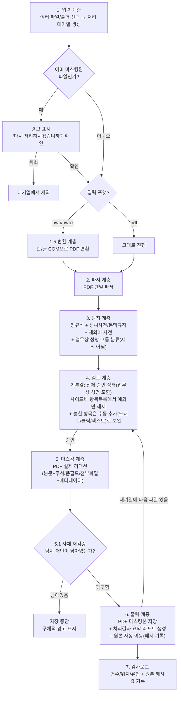

# 감사파일 개인정보 마스킹 자동화 — 아키텍처 설계서 (v17)

## 1. 배경 / 목표
감사실 담당자가 감사파일 내 개인정보를 수기로 하나씩 마스킹하는 비효율을 없애기 위한 도구.
전체 자동화가 아니라 **"자동 탐지·마스킹 + 사람의 최종 검토/승인"** 구조.

## 2. 범위
- **입력 파일**: hwp, hwpx, pdf
- **출력 파일**: **항상 PDF로 통일**
- **마스킹 대상 개인정보**: 주민등록번호/여권번호 등 식별번호, 이름, 전화번호/이메일/주소, 계좌번호/카드번호
- **사용자**: 감사실 내 소수 인원 (1~수명)
- **운영 형태**: 개인/비공식 프로젝트, IT/서버 인프라 지원 없음
- **개발 주체**: 감사실 인턴 개인 프로젝트
- 스캔 이미지 PDF는 1차 범위 밖 (OCR은 2단계에서 추가 검토)

### 2.1 개발·배포 선행 조건 (인턴 개인 프로젝트 특성상 반드시 지킬 순서)
1. **개발/테스트 단계에서는 실제 감사파일을 절대 사용하지 않음** — 실제 파일과 동일한 형식(hwp/hwpx/pdf, 표 구조 등)을 모방한 **더미 데이터**(가짜 이름·주민번호·연락처)로만 개발/검증
2. 도구가 어느 정도 완성되면 **프로토타입으로 시연** — 이 시점 전까지는 실제 업무에 투입하지 않음

## 3. 핵심 설계 변경 이력
- **v1 → v2**: hwp/hwpx/pdf 3종 파서를 각각 만드는 대신, hwp/hwpx는 PDF로 변환 후 **PDF 엔진 하나로 통일** 처리. 결과물은 항상 PDF (편집용이 아닌 최종/보관용이므로 감수).
- **v2 → v3**: "기술적으로 맞는 설계"에서 "감사실에서 매일 써도 편한 설계"로 보강. 검토 속도, 탐지 정확도, 재처리 유연성, 사후 증빙 자료까지 고려.
- **v3 → v4**: 편의 기능보다 **"마스킹의 기술적 정확성"을 최우선 요구사항으로 승격**. 저장 전 자체 재검증, 숨겨진 콘텐츠(주석/폼필드/첨부파일) 검사, 메타데이터 제거, 처리 원자성을 필수 항목으로 추가.
- **v4 → v5**: 기능/편리성/보안성 3축으로 최종 자체 점검. 실행취소(Undo), 자체검증 실패 후 후속 흐름, 임시파일 전반 삭제 원칙, 오류 메시지의 개인정보 비노출을 필수 항목으로 보강. 진행률 표시·이력 조회 UI는 향후 확장으로 분류.
- **v5 → v6**: "업무상 성명(결재선 등)은 마스킹 안 해도 된다"는 가정을 재검토. 실제 관찰상 관계부서 담당자 등도 마스킹되는 경우가 있어, 시스템이 임의로 제외하지 않고 **그룹만 나눠 보여주되 기본값은 마스킹 대상(체크됨)**으로 정책 수정 — 판단 근거가 불확실할 땐 더 안전한 쪽(가리는 쪽)을 기본값으로 함.
- **v6 → v7**: 문서 전체를 같은 기준("확인 안 된 가정을 사실처럼 적어놓은 곳 없는지")으로 재점검. **주소 탐지 방법 누락**(실제 설계 구멍)과 **로그 처리자 식별 방법 미정**을 보완하고, hwp 변환 실패 케이스(매크로 경고/파일 잠금/충돌)를 리스크에 추가. 마스킹 형태(부분/완전) 등 여전히 미확인인 가정들은 "9. 실사용 전 반드시 확인해야 할 가정" 섹션으로 별도 정리.
- **v7 → v8**: **결과물 파일명 자체에 개인정보가 남는 문제**를 발견해 수정 — `원본파일명_마스킹.pdf` 대신 `[문서유형]_[처리일자]_[일련번호].pdf` 형식으로 변경(문서유형은 검토 단계에서 사람이 직접 선택). 이에 따라 재실행 방지 판별 기준도 파일명이 아닌 폴더 경로+비개인정보 마커 기준으로 함께 수정.
- **v8 → v9**: 잔여 보완 사항 반영 — 주민번호/여권번호 정규식·마스킹 표기를 형식에 맞게 분리, 자체 재검증이 "리댁션 실패"만 잡고 "탐지 실패"는 못 잡는다는 한계를 명시, 재검증 실패 시 "재시도"가 구조적 원인엔 무의미할 수 있음을 명시, 문서 내 버전 라벨 오타 수정.
- **v9 → v10**: 더미 데이터로 핵심 파이프라인(탐지→리댁션→재검증→메타데이터 제거)을 실제로 구현·실행해 프로토타입 검증(7.1). "실제 리댁션이 PDF 바이트 레벨에서 완전히 제거된다"는 핵심 주장을 실측으로 증명. 동시에 **회전된 텍스트에서 탐지·재검증이 모두 통과 못 시키는 실패 사례를 실제로 재현**해, 6.5.1에 회전 텍스트 경고 완화책을 추가.
- **v10 → v11**: 부분마스킹(이름/전화번호)이 리댁션+텍스트 재삽입 방식으로 실제로 가능한지 추가 실측 — 좌표까지 확인해 시각적으로 정상 렌더링됨을 증명. 다만 재추출 시 정렬 옵션(`sort=True`) 없이는 추출 순서가 흐트러질 수 있음을 발견해 자체 재검증 로직에 반영.
- **v11 → v12**: PoC 결과를 토대로 "성공 기준 정의 → 엔지니어링 요약 → 기준 대비 평가 → 진행 여부 결정"의 타당성 평가를 12번 섹션으로 추가. 결론은 진행(GO)이되, "완전 자동화된 궁극의 솔루션"이 아니라 "사람의 최종 검토를 전제로 안전성을 기술로 보강한 보조 도구"임을 명확히 함.
- **v12 → v13**: 검토 화면에 **수동 추가**(드래그/클릭/텍스트 직접 입력) 기능을 반영 — 자동탐지가 놓친 항목을 검토자가 직접 지정해 같은 마스킹 파이프라인으로 처리할 수 있도록 6.3을 보강. "탐지 자체가 안 된 케이스"에 대한 사후 재작업 부담을, 마스킹 실행 전인 검토 단계 안에서 흡수하기 위함. 이에 따라 6.5.1(자체 재검증)과 8번(리스크), 9번(확인 필요 가정)도 함께 보강. 그 밖에 검토·탐지 효율을 높이는 보조 기능(원본-마스킹본 비교 뷰, 사전 자동 학습, 문서 템플릿 지문 인식, 교차검증 규칙, 동일 값 일괄 처리, 페이지 단위 진행 상태 표시, 저신뢰 항목 우선 정렬, 정확도 신뢰 리포트 등)을 함께 추가.
- **v13 → v14**: v13 반영 후 재검토에서 나온 문서 내부 일관성 문제들을 정리. 6.5.1에서 OCG를 주석/폼필드/첨부파일과 같은 취급("발견 시 제거")으로 묶어 서술했던 걸 분리 — OCG는 구조적으로 "존재 감지"까지만 가능하고 "내용 스캔"은 불가능하다는 구현상의 한계를 명시. 계좌번호/카드번호 마스킹 정책이 6.5 표/7번 정책표/9번 표 세 곳에서 서로 다르게 읽히던 걸 "9번 참고, 확정 대기" 플래그로 통일. 10번 "다음 단계"에서 3번(검토 UI)만 6.3.1~6.3.6 우선순위로 쪼개져 있고 1번(탐지 엔진)은 v12 목록 그대로 남아있던 비대칭을 바로잡아, 1번도 6.2.1~6.2.3을 반영한 하위 순서로 재구성. 11번 향후확장후보에 남아있던 중복 항목("문서 양식별 템플릿 프로파일" → 6.2.2로 이미 구체화됨, "페이지 단위 진행 상태 표시" → 6.3.4로 이미 정식 반영됨) 정리. 12번 타당성평가가 v11 PoC 시점에 멈춰있어 v13 UI 기능들의 영향이 미반영이라는 점을 콜아웃으로 명시.
- **v14 → v15**: MVP 마스킹 로직을 "문자열 값 기반"에서 "위치 기반"으로 재작성. 이전에는 승인된 항목의 값으로 페이지 전체를 `search_for()` 재검색해서 마스킹했기 때문에, 같은 문자열(예: "김테스트")이 신청인/예금주 등 문서 여러 곳에 등장하면 검토자가 특정 항목 하나만 체크 해제해도 같은 값의 다른 위치가 그대로 마스킹되고 `masked_counts` 집계도 실제 처리 건수와 어긋나는 문제가 있었다(실측 확인). `mvp/pdf_extract.py`를 새로 도입해 탐지(`detector.detect_all`)와 마스킹(`masker.apply_masking`)이 항상 같은 방식(`get_text("dict", sort=True)`)으로 추출한 오프셋/스팬 매핑을 공유하도록 바꾸고, `Finding.start/end`를 실제 좌표로 되짚어 승인된 "그 위치"만 정확히 마스킹하도록 수정. 위치를 못 찾은 항목은 무조건 실패로 처리해 저장을 막음(self_check만으로는 "지워짐"과 "애초에 못 찾음"을 구분할 수 없으므로).
- **v15 → v16**: MVP에 6.5.2(처리 원자성) + 6.6(원본 자동 이동) + 6.7(최소 로그)를 실제로 구현·검증 (`mvp/pipeline.py`, `mvp/audit_log.py`). "마스킹본 저장 → 원본 이동 → 로그 기록"을 하나의 트랜잭션으로 묶어, 성공/자체검증 실패/커밋 중 실패(원본 이동 후 로그 기록 실패 등) 세 경로를 모두 재현해 실패 시 원본이 항상 원래 위치로 복구됨을 실측으로 확인. 로그는 CSV로 건수/유형+원본 SHA-256 해시만 기록하며, 재검증 실패 메시지에 leftover 값(개인정보 실값)이 그대로 출력되던 기존 MVP의 6.5.3 위반도 함께 수정(건수만 출력하도록 변경).
- **v16 → v17**: 실제 마우스 클릭 이벤트(QTest) 기반 UI 테스트와 non-mocked 실패 주입(chattr로 진짜 쓰기 불가 상황 재현 등)으로 `mvp/tests/`를 만들어 전 계층을 실측 검증, 그 과정에서 발견한 문제 4건을 모두 수정:
  1. **숨겨진 콘텐츠가 경고만 되고 실제로는 제거되지 않던 문제** — `has_hidden_content()`는 존재 여부만 boolean으로 반환할 뿐 주석/폼필드/첨부파일 내용을 스캔·제거하지 않아, 검토자가 승인한 적 없는 PII가 "재검증 통과"로 표시된 최종 파일에 그대로 남아있었다(주석·첨부파일로 실측 재현). `scrub_hidden_content()`를 추가해 이 영역들을 독립적으로 `detect_all()`에 통과시켜 발견 즉시 마스킹하고, `hidden_content_leftover()`로 스크러빙 후 재검증까지 하도록 수정. 폼필드는 `widget.field_value` 자체를 마스킹된 값으로 바꾸고 `widget.update()`로 외형을 재생성하는 방식으로 실제 마스킹이 가능해짐(이전엔 리댁션 API가 폼필드 외형을 못 지워 자체검증 실패로 영구히 저장이 막혔음). OCG(선택적 콘텐츠 레이어)는 꺼진 레이어 콘텐츠가 기본 텍스트 추출에서 아예 빠지는 별도의 구조적 난제라 이번 수정 범위에서는 제외하고 존재 경고만 유지.
  2. **회전된 텍스트 마스킹 시 대체 텍스트 중복 삽입** — 위치 기반 마스킹(v15)으로 바뀐 뒤에도 좌표 계산(`pdf_extract.rects_for_range`)이 항상 가로 진행(dir=(1,0))을 가정했던 탓에, 회전된(세로쓰기) 스팬에서는 계산된 위치가 실제와 달라 마스킹 텍스트가 엉뚱한 위치에 삽입되고 항상 가로로만 그려지는 문제가 실측으로 확인됨(PII 자체는 지워지지만 결과물이 시각적으로 깨짐). 텍스트 진행 방향 벡터(`line["dir"]`)를 따라 폭을 투영하고 `insert_text(..., rotate=...)`로 원본과 같은 방향으로 삽입하도록 수정.
  3. **처리 원자성의 사전조건 실패가 예외로 그대로 전파되던 문제** — `process_atomic()`의 워크스페이스 `mkdir()`이 트랜잭션 try 블록 밖에 있어, 사전조건이 깨지면(예: `원본_보관` 자리에 이미 파일이 있음) 파이썬 예외가 그대로 `main.py`까지 전파돼 사용자에게 트레이스백이 노출됐다. mkdir을 자체 try/except로 감싸 깔끔한 실패 결과(`workspace_setup_failed`)로 바뀌도록 수정.
  4. **(위 수정 과정에서 추가로 발견) 리댁션이 다른 주석을 덮어 삭제할 때 생기는 orphan 객체 바이트 잔존** — FreeText 주석처럼 본문 텍스트로도 추출되는 주석은 리댁션 영역과 겹치면 PDF 스펙상 주석 자체가 삭제되는데, 참조가 끊긴 주석의 원본(마스킹 전) 어피어런스 스트림 객체가 `doc.save()`의 기본 옵션으로는 가비지 컬렉션되지 않아 파일 바이트에 그대로 남아있었다(전화번호·이메일로 실측 재현 — `self_check()`는 "현재 참조되는 구조"만 보므로 이 클래스의 leftover는 원천적으로 못 잡는다는 것도 함께 확인). `doc.save(..., garbage=4, deflate=True)`로 근본 원인을 없애고, `raw_byte_leftover()`로 저장된 파일을 바이트 단위로 재검증하는 안전망도 추가(단, 한글은 CID 임베디드 폰트로 저장돼 애초에 리터럴 바이트가 아니므로 이 바이트 검사는 라틴/숫자 PII에만 유효 — 한글은 `garbage=4`의 근본 조치에 의존).

  네 가지 모두 `mvp/tests/`에 수정 전(버그 재현)·수정 후(정상 동작) 양쪽을 커버하는 회귀 테스트로 고정.

## 4. 실행 환경 결정
- **로컬 Windows 데스크톱 프로그램**, 서버 없음
- 담당자 PC에 한컴오피스(한/글) 설치됨을 전제 → hwp/hwpx → PDF 변환에 필요
- 배포: PyInstaller로 패키징한 **단일 .exe**, 파이썬 설치 불필요
- UI: **로컬 데스크톱 창 (PySide6/Qt)**

## 5. 전체 아키텍처



> 5→6 사이의 자체 재검증(5.1)을 통과하지 못하면 어떤 파일도 `마스킹완료/`나 `원본_보관/`으로 이동하지 않음 — 실패는 항상 "아무 일도 안 일어난 상태"로 귀결.

## 6. 계층별 상세 설계

### 6.1 변환 계층 (hwp/hwpx → PDF)
- `pywin32`로 한/글 COM을 열어 "다른 이름으로 저장 → PDF" 호출
- 변환 성공 여부만 검증하면 되므로 구현·테스트 범위가 작음
- Windows + 한컴오피스 설치 환경에서만 실행/검증 가능
- **변환 실패 케이스 처리 (신규)**: 아래 상황은 변환이 안 되거나 예상과 다르게 동작할 수 있어 명시적으로 감지하고 안내해야 함
  - 매크로 보안 경고창이 뜨는 hwp (자동화 호출이 막힘)
  - 비밀번호로 잠긴 hwp
  - 사용자가 이미 한/글을 열어둔 상태에서 자동화 호출 시 충돌
  - 손상되었거나 지원하지 않는 버전의 hwp 파일
  - 위 경우 모두 **원본은 그대로 두고, 해당 파일만 대기열에서 실패 처리 + 구체적인 실패 사유를 사용자에게 표시** (전체 배치가 멈추지 않도록)

### 6.2 파서 / 탐지 계층 (PDF 단일 경로)
- `PyMuPDF(fitz)`로 텍스트와 좌표 추출, 표 내부 텍스트도 동일 경로로 처리
- 전화번호/이메일/계좌번호/주민등록번호: **정규식** 기반 (주민등록번호는 체크섬 규칙까지 적용해 오탐 축소)
- **여권번호**: 주민등록번호와 형식이 완전히 다름(영문자 1자 + 숫자 8자) → 별도의 정규식 패턴 필요, 같은 "식별번호"로 뭉뚱그려 하나의 패턴으로 처리하지 않도록 주의
- 이름: **성씨 사전 + 문맥 규칙**("성명:", "담당:" 등 라벨 뒤 텍스트)으로 1차 탐지
- **주소 (설계 누락 보완, 신규)**: 주소는 전화번호/계좌번호처럼 고정된 패턴이 없어 정규식만으로 탐지 불가 → **행정구역 사전(시/도·시/군/구 명칭 목록) 매칭 + "주소:", "거주지:" 라벨 문맥 규칙**을 조합해 탐지. 이름과 마찬가지로 오탐/누락 가능성이 상대적으로 높은 항목이라 검토 단계 의존도가 큼
- **제외어 사전**: 부서명/직책명/회사명처럼 성씨로 오인되기 쉬운 흔한 단어 목록을 별도로 관리해 오탐 축소 (직원 명부 없이도 구축 가능)
- **업무상 성명 그룹 분류 (v6에서 정책 수정)**: "직위+이름"("감사팀장 홍길동") 패턴, 문서 상/하단 결재란 위치의 이름은 별도 그룹("업무상 성명 후보")으로 나눠서 보여줌 — 단, **자동 제외는 하지 않고 기본값은 다른 항목과 동일하게 "마스킹 대상(체크됨)"**. "공무 수행 중 성명은 통상 마스킹 안 해도 된다"는 게 일반론일 뿐 감사실의 실제 마스킹 기준과 다를 수 있다는 걸 확인했기 때문 — 관계부서 담당자처럼 결재선이 아니어도 문서에 등장하는 인물은 마스킹 대상일 수 있음. 그룹으로 나누는 이유는 어디까지나 "검토자가 한 번에 훑어보고 판단하기 쉽게" 하기 위함이지, 안전 쪽 판단을 시스템이 대신하지 않기 위함
- 향후 정확도가 부족하면 한국어 NER 모델(로컬 추론) 추가를 2단계 개선 항목으로 남겨둠

### 6.2.1 사전 자동 학습 (v13 신규)
검토자가 이미 하는 행동(체크 해제, 수동 추가)만으로 성씨사전/제외어사전을 조용히 개선. **확인 팝업 없이** 진행하는 것이 핵심 조건.

흐름:
```
검토자가 항목 체크 해제 또는 수동 추가
        ↓
해당 단어/패턴을 "제외어 후보" 또는 "이름 후보" 테이블에 조용히 기록
(화면엔 아무것도 안 보임 — 검토자는 원래 하던 검토만 계속함)
        ↓
같은 단어가 같은 방향으로 임계값(기본 3회) 이상 반복 처리됨
        ↓
그 시점에만 사이드바 구석에 조용한 알림 표시
"감사팀 → 3회 반복 제외됨, 사전에 반영했습니다 (되돌리기)"
        ↓
사전(성씨사전/제외어사전)에 자동 반영 → 다음 문서부터 탐지 결과에 즉시 적용
```

설계 조건:
- **질문형이 아니라 통보형**: "추가할까요?"가 아니라 "추가했습니다"로 — 확인 절차 자체를 없애는 게 핵심
- **임계값으로 오염 방지**: 1회만으로 반영하면 우연한 케이스로 사전이 오염될 수 있어 반복 횟수 기준을 둠
- **되돌리기 가능**: 통보 옆에 취소 버튼을 둬서 잘못 반영됐으면 바로 되돌릴 수 있게 함
- **로그와 연동**: 6.7의 자동탐지/수동추가 출처 구분 로그가 이 학습 기능의 데이터 소스가 됨 — 별도 시스템이 아니라 기존 로그를 재활용

개발자가 직원명부에 접근할 수 없어 사전 구축용 화이트리스트를 미리 만들 수 없는 상황(9번 표 참고)을 이 기능이 우회함 — 실사용자(감사실 직원)가 도구를 쓰는 과정 자체가 그 조직 전용 이름/제외어 목록을 자동으로 축적시키는 구조이므로, 명부 접근 없이도 시간이 지날수록 그 조직에 특화된 정확도로 수렴함.

### 6.2.2 문서 템플릿 지문 인식 (v13 신규)
감사실 문서는 반복되는 정해진 양식(지출결의서, 출장복명서 등)이 많다는 특성을 활용. 문서를 처음 처리할 때, 탐지된 개인정보 항목들의 **상대 좌표 패턴**(페이지 내 위치, 주변 라벨텍스트 등)을 "템플릿 지문"으로 저장. 같은 양식(레이아웃 유사도로 판별)이 재입력되면, 저장된 지문의 좌표 근처를 우선적으로 재확인 — 탐지 엔진이 놓친 위치라도 "이 양식에서는 통상 여기에 이름이 나온다"는 근거로 검토자에게 우선 확인 대상으로 제시.

기존 섹션 11의 "문서 양식별 템플릿 프로파일" 확장 후보를 탐지 정확도 향상 목적으로 구체화한 것 — 6.7의 로그(자동탐지/수동추가 출처 구분)와 함께 쌓이는 데이터를 재활용해 구현 가능.

### 6.2.3 교차검증 규칙 (v13 신규)
서로 다른 탐지 결과끼리 문맥으로 서로의 확신도를 보강하는 규칙. 예:
- 전화번호 형식(010-XXXX-XXXX)이 탐지된 위치 주변에 "발신자:", "연락처:" 같은 라벨이 있으면, 바로 옆의 미탐지 텍스트도 이름일 확률이 높다고 보고 이름탐지 확신도 상향
- "성명:" 라벨 뒤에 이미 확정된 이름이 있고, 문서 내 다른 곳에 같은 라벨 패턴이 반복되면 그 위치도 우선 탐지 후보로 격상

단독 정규식/사전 규칙보다 문맥 간 상호보강으로 오탐/누락을 추가로 줄이는 방향. 6.3의 "저신뢰 항목 우선정렬"과 연동해, 교차검증으로 확신도가 상향된 항목은 정렬 순위도 함께 조정.

### 6.3 검토 계층 (UI)
- **기본값은 "전체 승인" 상태**: 탐지된 항목은 모두 마스킹 예정으로 미리 체크되어 있고, 검토자는 **틀린 것만 클릭해서 해제**하면 됨 (건별로 일일이 확인/추가하는 방식보다 훨씬 빠름)
- 사이드바에 탐지 항목 목록("이름 3건, 전화번호 1건...")을 유형별로 표시, 클릭하면 해당 위치로 자동 이동
- **"업무상 성명" 그룹도 다른 항목과 동일하게 기본 마스킹 대상(체크됨)** — 화면에서 그룹만 나눠 보여줘서 검토자가 한 번에 판단하기 쉽게 할 뿐, 시스템이 미리 판단해서 빼주지 않음 (안전한 기본값: 확실하지 않으면 가림)
- 키보드 단축키(다음 항목, 포함/제외 토글, 전체 승인)로 반복 작업 속도 향상
- 모든 항목 확정 후 "승인" 버튼으로 다음 단계(실제 마스킹) 진행
- **문서 유형 선택 (v13 수정)**: 승인 전, 결과 파일명에 쓸 **문서 유형**을 드롭다운(예: 지출결의서/출장/민원/계약/기타)에서 선택하거나 **직접 입력(자유 텍스트)**으로도 지정 가능. 감사 결과물 유형이 실제로는 사전에 정의한 몇 가지 범주로 다 커버되지 않을 만큼 다양하므로, 목록에 없는 경우 검토자가 직접 타이핑해서 입력할 수 있게 함. 직접 입력한 값도 6.6의 파일명 규칙(`[문서유형]_[처리일자]_[일련번호].pdf`)에 그대로 사용되므로, **파일명에 안전하지 않은 문자(공백, 슬래시, 특수문자 등)는 자동으로 치환/제거** 처리 필요(예: 공백 → 언더스코어, `/` 등 경로 구분자 제거). 한 번 직접 입력한 값은 이후 같은 세션/사용자 기준으로 드롭다운 목록에 자동 추가해두면, 반복되는 문서유형은 다음부터 드롭다운에서 바로 고를 수 있어 편의성이 올라감(선택적 개선)
- **다중 파일 지원**: 여러 파일을 한 번에 선택하면 처리 대기열이 만들어지고, 검토 화면에서 파일 단위로 하나씩 넘기며 확인 (배치 자동 처리는 아님 — 파일마다 사람이 검토)
- **실행취소(Undo/Redo)**: 항목 추가/해제, 전체승인/전체해제 같은 검토 조작은 모두 되돌릴 수 있어야 함 (`Ctrl+Z` 등). 승인 전 단계는 아직 파일에 손을 대지 않은 상태이므로 자유롭게 되돌릴 수 있음

### 6.3.1 수동 추가 (v13 신규)
자동탐지가 놓친 개인정보를 검토자가 그 자리에서 직접 지정해 마스킹 대상으로 추가할 수 있음. 세 가지 입력 방식을 모두 지원:

| 방식 | 동작 | 좌표 확보 방법 |
|---|---|---|
| **드래그** | 화면에서 영역을 직접 지정 | 사용자가 지정한 사각 영역 그대로 사용 |
| **클릭** | 단어 하나를 빠르게 지정 | 클릭 좌표와 겹치는 단어를 `get_text("words")`로 찾아 해당 단어의 bbox 사용 |
| **텍스트 직접 입력** | 화면에서 찾기 어렵거나(회전텍스트, OCG) 반복되는 문자열을 한 번에 지정 | `page.search_for()`로 문서 전체 재검색 → 매칭되는 모든 위치의 bbox를 후보로 제시 |

**텍스트 입력 시 다중 매칭 처리 (중요)**: 같은 문자열이 문서 여러 곳에 나타날 수 있음(예: 결재선의 이름 vs 본문 내 동명이인 언급). 매칭이 2건 이상이면 즉시 전부 추가하지 않고, "N곳에서 발견됨" 목록을 보여주고 검토자가 개별 선택 또는 전체 선택하도록 함.

**유형/마스킹 형태 지정**: 자동탐지 항목과 달리 수동 추가 항목은 유형 정보가 없음. 추가 시 유형(이름/전화번호/계좌번호/기타 등) 선택 드롭다운을 같이 띄우고, 미선택 시 기본값은 **완전마스킹**으로 처리. 유형을 지정하면 6.5의 항목별 차등 마스킹 규칙(부분/완전)을 그대로 적용.

**시각적 구분**: 수동 추가 항목은 사이드바 목록에서 자동탐지 항목과 다른 표시(예: 별도 아이콘·색상)로 구분 — 나중에 "이 문서에서 자동탐지가 실제로 몇 건을 놓쳤는지" 파악하는 데 활용 가능(11번 "문서유형별 놓친 항목 누적 통계" 참고).

수동 추가 항목도 승인 후 자동탐지 항목과 완전히 동일한 파이프라인(5번 마스킹 계층 → 6.5.1 자체 재검증)을 거침.

### 6.3.2 원본-마스킹본 비교 뷰 (v13 신규)
검토자가 승인 전/후로 "실제로 뭐가 바뀌는지"를 바로 옆에서 눈으로 대조할 수 있는 기능. 두 가지 시점에서 쓰임새가 다름:

**① 승인 전 — 탐지 결과 미리보기 비교**: 왼쪽에 원본 페이지, 오른쪽에 "지금 체크된 항목이 실제로 마스킹되면 어떻게 보일지" 시뮬레이션한 미리보기를 나란히 표시. 체크박스를 켜고 끌 때마다 오른쪽 미리보기가 실시간으로 갱신됨. 검토자가 "이 항목을 지우면 문맥이 이상해지나?"를 승인하기 전에 확인 가능. 구현 방식: 실제 리댁션(5번 계층, 바이트 레벨 제거)을 매번 실시간 실행하는 건 비용이 크므로, 미리보기 단계에서는 **화면에만 검은 오버레이를 임시로 그리는 방식**(실제 파일은 안 건드림)으로 처리. 승인 버튼을 눌러야 비로소 진짜 리댁션(5번 계층)이 실행됨 — 이 구분을 검토자에게도 명확히 안내(예: "미리보기입니다. 승인 시 실제 처리됩니다").

**② 승인 후 — 원본 vs 완성된 마스킹본 비교**: `원본_보관/`에 있는 원본과 `마스킹완료/`에 있는 결과물을 같은 화면에 나란히 열어 최종 확인. 주로 "이 문서 처리 결과가 맞게 됐는지 나중에 다시 확인하고 싶을 때"(예: 요약리포트 보고 "진짜 이렇게 처리됐었나?" 재확인) 쓰임 — 6.8 요약리포트나 향후 확장 후보인 "처리 이력 조회 UI"(섹션 11)에서 파일을 열람할 때 이 비교 뷰로 연결하면 자연스러움.

설계상 주의점:
- ①은 검토 세션 중에만 필요하고 파일을 안 건드리므로 구현 리스크가 낮음 — 검토 UI 구현 시 우선 포함할 만함
- ②는 `원본_보관/`의 원본을 다시 여는 기능이라, 원본 파일이 개인정보를 포함한 채로 그대로 있다는 점에서 **접근 권한 관리**(6.6에서 "권고"로만 남겨둔 원본 폴더 접근제한)와 맞물림 — 이 비교 뷰를 만들면 오히려 원본에 다시 접근하는 경로가 하나 늘어나는 셈이라, 이 기능을 넣을 거면 원본 폴더 접근제한을 "권고"에서 "필수"로 격상하는 것도 같이 고려할 만함

### 6.3.3 동일 값 일괄 처리 (v13 신규)
문서 내 같은 문자열(이름/번호 등)이 여러 곳에 나타나는 경우, 항목을 우클릭(또는 롱프레스)하면 "문서 내 동일 값 N건 발견 — 전체 선택/전체 해제" 옵션을 제공. 자동탐지 항목에도 수동추가(텍스트입력)의 다중매칭 로직을 그대로 재사용해 적용 — 별도 신규 로직이 아니라 기존 `page.search_for()` 기반 다중매칭 처리를 우클릭 메뉴로 노출하는 것.

### 6.3.4 페이지 단위 진행 상태 표시 (v13 신규)
긴 문서를 검토하다 중단했다 돌아오거나, 여러 페이지 중 일부를 실수로 안 보고 넘어가는 사고를 방지. 화면 상단/사이드바에 진행바 표시:
```
[■■■■■■■■□□□□]  8 / 12 페이지 검토 완료
```
페이지를 넘길 때마다 자동으로 "검토완료"로 표시되고, 안 넘어간 페이지는 회색으로 남음. 승인 시점에 안 본 페이지가 남아있으면 "N페이지를 아직 확인하지 않았습니다" 경고를 띄워 승인을 차단, 실수로 미검토 페이지를 그대로 승인하는 사고를 방지.

세부 보강 항목:
- **진행바 클릭 시 해당 페이지로 즉시 이동** — 미검토(회색) 구간을 클릭하면 스크롤해서 찾을 필요 없이 바로 점프
- **페이지별 탐지 건수 미니 배지** — 진행바 각 칸 위에 "이 페이지 탐지 3건"처럼 작은 숫자 표시, 어느 페이지에 검토할 게 많은지 한눈에 파악
- **경고 페이지 색 강조** — 회전텍스트/OCG 경고가 있는 페이지는 진행바에서 다른 색(예: 노란색)으로 표시해, 놓치기 어렵게 시각적으로 구분
- **"안 본 페이지만 보기" 필터 토글** — 문서가 길 경우, 이미 검토완료로 표시된 페이지를 건너뛰고 미검토 페이지만 순서대로 보여주는 옵션

구현 부담이 적음 — 이미 존재하는 페이지 넘김 이벤트를 카운트해서 시각화하는 정도.

### 6.3.5 저신뢰 항목 우선 정렬 (v13 신규)
사이드바 탐지 항목 목록을 **탐지 확신도가 낮은 순으로 정렬**해서 표시. 확신도는 이미 탐지 방식(정규식/사전규칙/그룹분류)에서 파생 가능:

| 탐지 방식 | 확신도 | 정렬 위치 |
|---|---|---|
| 정규식 매칭 (전화번호/계좌번호/주민번호/이메일) | 높음 | 목록 하단 |
| 성씨사전 + 문맥규칙 (이름) | 중간 | 목록 중간 |
| 업무상 성명 그룹, 주소(행정구역사전+문맥규칙) | 낮음 | 목록 상단 |

새 탐지 로직이 아니라 기존에 이미 갖고 있는 탐지방식 정보를 정렬 기준으로 재활용. 검토자는 위쪽(저신뢰)부터 집중해서 보고, 아래쪽(고신뢰)은 빠르게 훑고 넘어갈 수 있어 검토 시간을 우선순위에 따라 배분 가능. 6.2.3의 교차검증으로 확신도가 상향된 항목은 정렬 순위도 함께 조정됨.

### 6.3.6 실사용자 편의 기능 (v13 신규)
**항목 클릭 시 자동 확대**: 사이드바에서 탐지 항목을 클릭하면 해당 위치로 이동할 뿐 아니라 화면이 자동으로 확대되어 중앙에 오도록 함. 주민번호처럼 숫자 한두 자리 차이가 중요한 항목에서 오독으로 인한 잘못된 판단(체크/해제 실수)을 줄임.

**"다음 미확정 항목" 순회 단축키**: 기존 "다음 항목" 단축키와 별도로, **저신뢰(6.3.5 우선정렬 기준) 항목만 골라서 순회**하는 단축키를 제공. 확신도 높은 항목(정규식 매칭 등)은 건너뛰고, 실제 판단이 필요한 애매한 항목만 빠르게 훑을 수 있음.

### 6.4 재실행(중복 마스킹) 방지
- 이미 마스킹된 파일인지는 **① `마스킹완료/` 폴더 경로** 또는 **② PDF 안에 남겨둔 처리완료 표시(비-개인정보 마커, 예: 문서 속성에 `MaskingTool-Processed: true` 같은 값)**로 감지 (v8부터 파일명이 `_마스킹` 접미사가 아닌 `[문서유형]_[날짜]_[일련번호]` 형식으로 바뀌어 파일명 기반 감지는 더 이상 신뢰할 수 없음)
- 감지 시 경고 표시 후 **"다시 처리하시겠습니까?" 확인**을 거쳐야 진행 (완전 차단이 아님 — 마스킹 정책 변경 등으로 재작업이 필요한 실무 상황을 막지 않음)

### 6.5 마스킹 계층
- `PyMuPDF(fitz)`의 **실제 리댁션 API** 사용 (텍스트 레이어 자체 제거) — 단순 검은 박스 오버레이 금지
- **탐지된 개인정보만 텍스트를 지우고, 나머지 본문은 실제 텍스트 레이어로 그대로 유지** — 마스킹된 PDF에서도 개인정보를 제외한 내용은 복사/붙여넣기 및 텍스트 검색이 정상 동작해야 함 (문서 전체를 이미지로 평탄화하는 방식은 이 요구사항 때문에 배제)
- 항목별로 마스킹 형태를 다르게 적용:

| 항목 | 형태 | 예 |
|---|---|---|
| 이름 | 부분마스킹 | 홍*동 |
| 전화번호 | 부분마스킹 | 010-****-5678 |
| 이메일 | 부분마스킹 | ab***@domain.com |
| 주민등록번호 | 완전마스킹 | ******-******* (길이·하이픈 유지, 생년월일 포함 전부 마스킹) |
| 여권번호 | 완전마스킹 | ********* (길이 유지) |
| 계좌번호/카드번호 | 완전마스킹 ⚠️ | **-***-****** — **9번 표 참고, 확정 대기**: 실무상 끝 3~4자리를 남기는 부분마스킹이 더 일반적이라는 조사 결과가 있어 이 완전마스킹 정책을 부분마스킹으로 바꾸는 걸 권장 중. 과장님 확인 전까지는 아래 완전마스킹이 잠정 스펙이며, 개발 착수 시 이 값을 하드코딩하지 말고 쉽게 바꿀 수 있는 설정으로 둘 것 |

### 6.5.1 마스킹 정확성 보장 (필수) — "지워졌다고 표시되면 진짜 지워진 것"

검토 UX나 부가 기능보다 우선하는 요구사항. 아래 네 가지 없이는 저장을 완료 처리하지 않음.

1. **저장 전 자체 재검증(Self-check)**
   - 리댁션을 적용한 직후, 결과 PDF에서 텍스트를 **다시 추출**해 검토자가 승인했던 탐지 패턴(정규식/문자열)이 하나라도 남아있는지 재검사
   - **(PoC 실측) 텍스트 재추출 시 반드시 정렬 옵션(예: PyMuPDF의 `sort=True`)을 사용**: 부분마스킹으로 텍스트를 재삽입한 뒤 기본 옵션으로 추출하면 시각적 위치는 정확해도(렌더링은 정상) 추출 순서가 뒤섞여 나올 수 있음을 실측으로 확인 — 탐지·재검증 양쪽 모두 정렬 옵션을 일관되게 써야 오탐/누락 없이 신뢰할 수 있음
   - 하나라도 검출되면 **저장을 중단**하고 "N건이 완전히 지워지지 않았습니다"라고 구체적으로 경고 (회전된 텍스트, 특정 폰트 인코딩, 겹친 텍스트박스 등에서 리댁션 API가 실패하는 케이스를 잡아냄)
   - 재검증을 통과한 파일만 `마스킹완료/`로 최종 이동
   - **실패 후 후속 흐름**: 저장을 막는 것으로 끝나지 않고, 검토 화면으로 자동 복귀해 **남아있는 패턴의 위치를 별도로 하이라이트**해서 보여줌. 회전된 텍스트/폰트 인코딩처럼 **구조적 원인인 경우 같은 방식으로 재시도해도 다시 실패할 수 있음** — 무한 재시도를 유도하지 말고, 해당 페이지만 이미지로 변환 후 마스킹하는 대체 경로(최후 수단)를 제공하거나 파일명/페이지/패턴 유형을 안내해 개발자에게 보고하도록 함
   - **⚠️ 이 재검증이 잡아내는 것은 "리댁션 실패"이지 "탐지 실패"가 아님**: 재검증은 검토자가 승인했던 패턴이 잘 지워졌는지만 확인함. 애초에 탐지 엔진이 어떤 개인정보를 찾아내지 못했다면(예: 이름 탐지 누락) 재검증에도 걸리지 않고 그대로 통과함 — **"자체 재검증 통과"가 "이 문서에 개인정보가 하나도 안 남았다"는 보장은 아니라는 점을 UI 문구에서도 정확히 표현**해야 함 (예: "지운 항목은 확실히 지워졌습니다" ≠ "이 문서엔 개인정보가 없습니다")
   - **(v13 신규) 자동탐지·수동추가 항목을 구분하지 않고 동일하게 검사**: 자체 재검증은 항목의 출처(자동탐지 vs 6.3.1 수동 추가)를 구분하지 않음 — 검토자가 승인한 모든 항목(출처 무관)이 실제로 지워졌는지가 재검증의 대상

2. **숨겨진 콘텐츠 검사 (v17부터 실제 제거까지 구현됨)**
   - 본문 텍스트 레이어 외에 **주석(annotation), 폼필드(form field), 첨부파일(embedded file), 선택적 콘텐츠 레이어(OCG)**에도 원본 텍스트가 남아있을 수 있음 → 이 영역들도 스캔 대상에 포함하고, PII 패턴이 발견되면 함께 제거하거나 검토자에게 별도 경고
   - 주석/폼필드/첨부파일(텍스트로 디코딩 가능한 것)은 본문과 별개로 독립적으로 `detect_all()`에 통과시켜, PII가 나오면 그 자리에서 즉시 마스킹하고 스크러빙 후 재검증까지 수행함(`mvp/masker.py`의 `scrub_hidden_content()`/`hidden_content_leftover()`) — 검토자가 미리 볼 화면이 없는 영역이라 "확실하지 않으면 가리는" 기본값을 그대로 적용
   - OCG(선택적 콘텐츠 레이어)는 꺼진 레이어 콘텐츠가 기본 텍스트 추출에서 아예 빠지는(회전 텍스트와 비슷한) 구조적 난제라 아직 실제 스크러빙은 미구현 — 존재 경고만 유지되는 상태
   - hwp→PDF 변환 시 원본 hwp의 "숨은설명/메모"가 PDF 주석으로 옮겨지는 경우가 있어 특히 주의 필요
   - **⚠️ 선택적 콘텐츠 레이어(OCG)는 위 세 항목과 취급이 다름 (구조적 한계)**: OCG는 레이어가 꺼져(비활성) 있으면 기본 텍스트 추출 경로 자체에서 빠지므로, "레이어가 존재한다"는 사실은 감지할 수 있어도 "그 안에 어떤 PII가 있는지 내용을 스캔"하는 것은 구조적으로 불가능함. 즉 주석/폼필드/첨부파일처럼 "발견 → 제거"가 아니라, **"존재 감지 → 검토자에게 육안 재확인 경고"까지만 가능** — 6.5.1의 4번(회전 텍스트) 경고와 같은 성격(거짓 안전 방지용 경고이지 자동 제거가 아님). 문서 어디에서도 OCG를 "스캔해서 제거 가능한 항목"으로 서술하지 않도록 주의

3. **문서 메타데이터 제거**
   - PDF 문서 속성(작성자, 마지막 수정자, 회사명 등 Info dictionary + XMP 메타데이터)에 개인정보가 남을 수 있음 → 저장 시 메타데이터를 함께 비움
   - hwp→PDF 변환 과정에서 한/글 계정 정보가 작성자로 남는 경우가 흔하므로 특히 확인 필요

4. **회전/비정상 배치 텍스트 경고 (프로토타입 실측으로 발견, 신규)**
   - PoC 테스트에서 회전된 텍스트가 추출 과정에서 원문 그대로 잘리는 현상을 실제로 재현함 → 정규식이 매칭 못 해 애초에 탐지 후보에도 안 오르고, 탐지가 안 됐으니 자체 재검증도 "확인할 대상 자체가 없어" 그냥 통과해버림 (거짓 안전)
   - 완화책: `get_text("dict")`로 각 텍스트 블록의 방향(`dir`)을 확인하면 **내용은 못 믿어도 "회전된 텍스트가 존재한다"는 사실 자체는 감지 가능**함이 실측으로 확인됨 → 문서에 회전된 텍스트 블록이 하나라도 있으면 검토 화면에 "이 문서에 회전된 텍스트가 있습니다. 자동 탐지가 놓쳤을 수 있으니 육안으로 다시 확인하세요"라고 경고 표시

### 6.5.2 처리 원자성 (트랜잭션 안전)
- "마스킹본 저장 → 자체 재검증 → 원본 이동 → 로그 기록" 순서를 하나의 단위로 취급
- 중간 임시 파일에 먼저 쓰고, **재검증까지 통과한 뒤에만** 최종 위치로 이동 + 원본 이동 + 로그 기록을 수행
- 어느 단계에서든 실패하면 이미 만들어진 임시 파일을 정리하고 **원본은 손대지 않은 상태로 되돌림** — "일부만 처리된 애매한 상태"가 남지 않도록 함
- **임시 파일 전반의 삭제 원칙**: hwp→PDF 변환본뿐 아니라, 처리 과정에서 생기는 모든 중간 산출물(재검증용 임시 추출 텍스트, 미리보기 캐시 등)은 예외 없이 처리 종료 시점(성공/실패 불문)에 정리. OS 임시폴더에 개인정보가 포함된 파일이 남지 않도록 하는 것이 원칙

### 6.5.3 오류 처리 시 개인정보 비노출
- 처리 중 오류가 나면 화면 메시지·로그·예외 스택트레이스 어디에도 **문서의 실제 텍스트 내용은 포함하지 않음** (파일명, 페이지 번호, 오류 유형까지만 노출)
- 개발/디버깅 목적이라도 원문 텍스트를 로그 파일에 남기는 임시 디버그 코드는 배포 빌드에서 제거

### 6.6 출력 / 원본 보관
- 마스킹본: 자체 재검증을 통과한 파일만 `마스킹완료/` 폴더에 **PDF로** 저장
- **파일명 규칙 (v8에서 안전하게 수정)**: `원본파일명_마스킹.pdf`는 원본 파일명 자체에 개인정보가 있으면(예: `홍길동_민원처리결과.hwp`) 그 정보가 결과 파일명에 그대로 남는 문제가 있었음 → **`[문서유형]_[처리일자]_[일련번호].pdf`** 형식으로 변경 (예: `민원처리_20260730_001.pdf`). 문서유형은 검토 화면(6.3)에서 검토자가 직접 선택한 값을 사용해 자동탐지 실패 리스크를 피함
- **원본 파일명과의 매핑**: 실제로 어떤 원본에서 나온 결과물인지는 파일명만으론 알 수 없으므로, 로그(6.7)와 요약 리포트(6.8)에 원본 파일명을 남겨 도구 안에서 조회 가능하게 함 (향후 확장 예정인 "처리 이력 조회 UI"와 연결)
- 원본: 처리 완료 시 **자동으로 `원본_보관/` 폴더로 이동** (삭제하지 않음)
- 변환 중간 산출물(hwp→pdf 변환본)은 임시 폴더에서 처리 후 삭제
- (권고) `원본_보관/` 폴더 자체는 회사 IT 정책에 맞춰 접근 제한 또는 암호화 보관을 권장 — 이 도구가 직접 강제하기보다 운영 가이드로 안내

폴더 구조 예시:
```
감사파일마스킹/
├── MaskingTool.exe
├── 원본_보관/
├── 마스킹완료/   (모두 .pdf)
├── 요약리포트/
└── 로그/
```

### 6.7 감사 로그
- **건수/위치/유형만 기록**, 실제 개인정보 값은 로그에 남기지 않음
- **원본 파일 SHA-256 해시값 기록 (신규)**: 원본을 `원본_보관/`으로 이동할 때 해시를 같이 남겨, 나중에 "이 로그가 정말 이 원본에 대한 처리 기록인지" 위변조 여부를 검증할 수 있게 함. 구현 비용은 낮고(표준 해시 함수 호출 한 줄) 감사부서 특성상 효용은 큼
- **처리자 식별 방법 (설계 누락 보완, 신규)**: 로그의 "처리자"는 Windows 로그인 계정명을 자동으로 사용. 계정명이 실명이 아닌 경우(예: 공용 계정)를 대비해, 프로그램 최초 실행 시 처리자 이름을 한 번 입력받아 로컬에 저장해두고 이후 자동으로 사용하는 방식도 대안으로 남겨둠 — 어느 쪽으로 할지는 실제 PC의 계정 운영 방식에 따라 결정
- **탐지 출처 구분 (v13 신규)**: 각 마스킹 항목이 자동탐지로 잡힌 것인지, 검토자가 수동 추가(6.3.1)한 것인지 구분해서 기록 (예: `이름 2건(자동 1, 수동 1), 전화번호 1건(자동)`). 저비용으로 추가 가능한 필드지만, 누적되면 "어떤 문서유형에서 자동탐지가 유독 많이 놓치는지" 파악할 근거 데이터가 됨 → 향후 정규식/사전 개선의 우선순위를 정하는 데 활용 가능
- 예: `2026-07-30 14:02 | 원본: 지출결의서_홍길동_3월.hwp (sha256:ab12...) | 이름 2건(자동 1, 수동 1), 전화번호 1건(자동) 마스킹 → 결과물: 지출결의서_20260730_001.pdf | 처리자: OOO`
- 로컬 CSV 또는 SQLite로 저장

### 6.7.1 정확도 신뢰 리포트 (v13 신규)
6.7의 탐지출처 구분 로그(자동탐지/수동추가/체크해제 기록)를 일/주/월 단위로 집계해 도구 안에서 확인 가능하게 함. 새 데이터를 만드는 게 아니라 기존 로그를 집계만 하는 것.

예시 표시 형태: "이번 달 20건 처리 — 자동탐지 항목 중 94%는 검토에서 그대로 유지(정확), 6%는 검토 중 해제(오탐), 문서당 평균 2.3건이 수동으로 추가됨"

용도: 검토자가 도구의 신뢰도를 숫자로 확인 가능, 시간에 따른 오탐률 추이가 개선 근거 자료가 됨.

### 6.8 처리 결과 요약 리포트 (신규)
- 파일 마스킹 완료 시, 사람이 읽기 좋은 **1장짜리 요약본**을 `요약리포트/`에 같이 생성
- 내용: 원본 파일명, 처리일시, 처리자, 마스킹 유형별 건수, 결과물 파일명
- 용도: "이 문서 왜 이렇게 마스킹됐어요?"라는 질문에 로그를 뒤지지 않고 바로 첨부 가능한 증빙 자료

## 7. 결정된 정책 요약
| 항목 | 결정 |
|---|---|
| 출력 포맷 | 입력 포맷 무관, **항상 PDF로 통일** |
| 마스킹 형태 | 항목별 차등 (이름/연락처는 부분, 식별번호/계좌는 완전) ⚠️ 계좌/카드번호는 부분마스킹(끝 3~4자리 유지)으로 변경 권장 — 9번 표 참고, 확정 대기 |
| 원본 보관 | 자동으로 별도 폴더 이동 + SHA-256 해시 기록, 삭제 안 함 |
| 로그 수준 | 건수/위치/유형 + 원본 해시, 실값 미기록 |
| 검토 방식 | **기본 전체 승인 + 예외만 해제**, 사이드바 항목목록 + 단축키 |
| 성명 처리 | "업무상 성명"(직위+이름/결재선)은 그룹만 분리, **기본 마스킹 대상은 동일** (자동 제외 안 함) |
| 오탐 축소 | 성씨사전 + 제외어 사전(부서/직책/회사명) 병행 |
| 처리 트리거 | 도구 실행 후 파일/폴더 수동 선택 |
| UI 형태 | 로컬 데스크톱 창 (PySide6) |
| 배포 형태 | PyInstaller 단일 .exe |
| 스캔 이미지 PDF | 1차 범위 제외 (OCR은 2단계에서 추가) |
| 배치 처리 | 여러 파일 선택 → 대기열 생성 → 파일 단위 순차 검토 |
| 재실행 방지 | 경고 + 확인 절차 후 재처리 허용 (완전 차단 아님) |
| 결과 증빙 | 처리 결과 요약 리포트 자동 생성 |
| **마스킹 정확성** | **저장 전 자체 재검증 필수** — 본문 재추출 + 주석/폼필드/첨부파일 스캔 + 메타데이터 제거, 미통과 시 저장 자체를 차단 |
| 처리 원자성 | 임시 파일 → 재검증 통과 후에만 최종 이동, 실패 시 원본 무변경 롤백 |
| 검토 실수 방지 | 검토 화면 전 조작 실행취소(Undo/Redo) 지원 |
| 재검증 실패 대응 | 저장 차단 + 검토 화면 복귀, 남은 패턴 위치를 별도 하이라이트 |
| 임시 파일 처리 | 모든 중간 산출물을 성공/실패 불문 처리 종료 시 정리 |
| 오류 메시지 | 화면/로그/스택트레이스 어디에도 문서 원문 텍스트 미노출 |
| **결과물 파일명** | `[문서유형]_[처리일자]_[일련번호].pdf` — 원본 파일명에 개인정보가 있어도 결과물 파일명엔 남지 않음, 원본명은 로그/요약리포트로만 조회 |
| 재실행 방지 판별 기준 | 파일명이 아닌 폴더 경로 + PDF 내 비-개인정보 마커로 판별 |
| 회전 텍스트 경고 | 회전된 텍스트 블록 존재 시 검토 화면에 육안 재확인 경고 표시 |

## 7.1 프로토타입 실측 검증 (v9~v10, PoC)

말로만 된 설계인지 확인하기 위해, 더미 데이터(가짜 이름·주민번호·전화번호·계좌번호)로 PDF를 만들어 핵심 파이프라인(정규식 탐지 → 실제 리댁션/부분마스킹 → 자체 재검증 → 메타데이터 제거)을 실제로 돌려봄. (PyMuPDF, Linux 환경. 실제 감사파일은 사용하지 않음 — 2.1 선행 조건 준수)

| 검증 항목 | 결과 |
|---|---|
| 전화번호/주민번호/이메일/계좌번호 정규식 탐지 | ✅ 정상 |
| 리댁션 후 **PDF 원본 바이트 레벨**에서 개인정보 문자열 재검색 | ✅ 완전히 사라짐 (오버레이 방식이 아님을 실측으로 확인) |
| 마스킹 후 비-PII 본문의 텍스트 추출 가능 여부 | ✅ 정상 (한글 폰트를 제대로 지정했을 때) |
| 문서 메타데이터(author/title) 제거 | ✅ 정상 |
| **회전된 텍스트에서 탐지·마스킹이 실패하는 경우 재현** | 🔴 재현됨 — 회전 텍스트가 추출 과정에서 잘려서 정규식 매칭 실패 → 탐지도 자체검증도 통과 못 시킴(거짓 안전). 완화책(6.5.1의 4번 항목)을 이 테스트로 찾아냄 |
| **부분마스킹(`김테스트`→`김**트`, `010-1234-5678`→`010-****-5678`)이 리댁션+텍스트 재삽입으로 가능한가** | ✅ 가능 — 좌표 확인 결과 원래 글자 자리에 정확히 들어가 렌더링도 정상. 단, 재추출 시 정렬 옵션 없이는 순서가 흐트러질 수 있음을 발견해 6.5.1에 반영 |

→ 이 테스트로 "실제 리댁션이 오버레이와 다르다", "부분마스킹이 기술적으로 가능하다"는 핵심 주장은 확실히 증명됐고, 동시에 "자체 재검증도 만능이 아니다"라는 한계와 텍스트 재추출 시 정렬 옵션이 필요하다는 구현 디테일도 실측으로 드러남 — 문서에 반영 완료.

## 8. 개발 단계에서 유의할 리스크
- hwp/hwpx → PDF 변환은 이 세션(Linux)에서 실행 검증 불가 → Windows+한컴오피스 PC에서 별도 검증 필요
- PDF 리댁션은 "실제 텍스트 레이어 제거" API 사용 필수 (오버레이 방식 절대 금지)
- 자체 재검증 로직 자체도 탐지 엔진과 동일한 정규식/패턴을 재사용해야 함 — 검증 로직이 탐지 로직과 다른 기준을 쓰면 "통과됐지만 사실 다른 패턴이 남은" 맹점이 생길 수 있음
- 주석/폼필드/첨부파일/메타데이터 스캔은 PyMuPDF API로 커버 가능하나, hwp→PDF 변환 시 한/글이 어떤 형태로 이 요소들을 옮기는지 실측 필요 (문서화가 부족한 영역)
- "업무상 성명" 그룹 분류 규칙(직위+이름, 결재란 위치)은 어디까지나 화면에 묶어서 보여주는 용도일 뿐, 마스킹 여부를 시스템이 대신 판단하지 않음 — 실제로 어떤 이름까지 마스킹해야 하는지는 과장님의 실제 판단 기준을 관찰해서 반영해야 함 (아직 명확히 확인되지 않은 영역)
- 이름 탐지는 화이트리스트가 없어 정확도가 정규식 대비 낮을 수밖에 없음 — 검토 단계 UX가 실사용성의 핵심
  → 이 한계는 **검토 단계의 수동 추가 기능(6.3.1)으로 보완**함. 단, 수동 추가는 "검토자가 실제로 문서를 꼼꼼히 훑어봤을 때"만 효과가 있으므로, UX가 놓치기 쉽게 설계되면(예: 경고를 무시하고 바로 승인) 이 보완 장치도 무력화될 수 있음 — 회전텍스트/OCG 경고가 뜬 페이지는 검토자가 반드시 한 번 보게 만드는 장치(11번 "경고 페이지 강제 확인" 참고)가 함께 필요
- hwp→PDF 변환 과정에서 표/이미지 레이아웃이 미세하게 달라질 수 있음 — 초기 검증 필요

## 9. 실사용 전 반드시 확인해야 할 가정 (v7 신규)

지금까지 "일반론상 이럴 것이다"로 설계했지만, **실제 감사실 관행과 다를 수 있어 과장님 관찰/확인이 필요한 항목들**. 개발을 시작하더라도 아래는 하드코딩하지 말고 쉽게 바꿀 수 있는 설정값으로 남겨둘 것.

| 가정 | 현재 설계 | 확인 필요 이유 |
|---|---|---|
| 업무상 성명(결재선/관계부서) 마스킹 여부 | 기본적으로 마스킹 대상에 포함 (v6에서 안전 쪽으로 수정) | 실제로 어디까지 예외 처리하는지 과장님 기준 미확인 |
| 이름/연락처 = 부분마스킹, 식별번호/계좌 = 완전마스킹 | 항목별 차등 마스킹 | 사용자가 고른 "권장 옵션"일 뿐, 과장님이 실제로 쓰는 형식(부분 vs 완전)과 일치하는지 미확인 |
| 완전마스킹 시 자릿수를 전부 가릴지, 일부(끝자리 등) 남길지 | 전부 가림(`**-***-******`) | 계좌번호 등은 검증·조회 목적으로 끝자리를 일부 남기는 관행이 있는 조직도 있음 |
| 성씨 사전의 출처 | 미정 (일반적인 한국 성씨 목록 사용 예정) | 실제 사용 데이터 소스를 아직 정하지 않음 |
| 수동 추가 시 기본 마스킹 유형 (v13 신규) | 완전마스킹 | 실제로 어떤 유형이 더 많이 쓰일지, 완전마스킹 기본값이 과장님 관행과 맞는지 미확인 |
| 텍스트 입력 다중매칭 시 기본 동작 (v13 신규) | 개별 선택(전체 자동 추가 안 함) | 매번 개별 선택이 번거로울 수 있어, 실사용 후 "전체 선택 기본값"으로 바꾸는 게 나을 수도 있음 |
| **계좌번호/카드번호 마스킹 형태 (v13 신규)** | v12는 완전마스킹으로 설계됨 | **실무 조사 결과, 완전마스킹보다 끝 3~4자리를 남기는 부분마스킹이 일반적 관행** — 끝자리를 남겨야 "이게 어느 거래/계좌인지" 조회·대조가 가능해 업무 가용성이 유지됨. 완전마스킹은 오히려 현업이 마스킹을 풀거나 별도 메모를 남기는 2차 위험을 만들 수 있음. **v12의 완전마스킹 정책을 부분마스킹(끝 3~4자리 유지)으로 변경하는 것을 권장** — 단, 과장님의 실제 조회 필요 여부 확인 후 최종 확정 |

→ 다음에 과장님 작업을 관찰할 기회가 있으면, 이 표의 항목들을 하나씩 확인해서 채워 넣는 걸 권장.

## 10. 다음 단계
설계 완료 후 개발 착수 시 제안 순서:
1. 탐지 엔진 — 포맷 무관, 단위 테스트 가능. v13에서 6.2.1~6.2.3이 추가된 만큼, 아래 하위 순서로 진행:
   1. 기본 골격: 정규식 + 성씨사전/제외어사전 + 주소탐지 + 업무상성명그룹 분류 (v12 원안, 최우선 — 다른 모든 하위 기능이 이 위에서 동작)
   2. **사전 자동 학습(6.2.1)** — 직원명부 없이 화이트리스트를 구축하는 유일한 경로라, 실사용 데이터가 쌓이기 시작하는 시점부터 바로 동작해야 의미가 있음
   3. **교차검증 규칙(6.2.3)** — 탐지 확신도 스코어링에 관여하므로, 이 점수를 쓰는 6.3.5(저신뢰 항목 우선정렬)보다 먼저 준비돼 있어야 함
   4. **문서 템플릿 지문 인식(6.2.2)** — 문서를 여러 건 처리해 좌표 패턴이 쌓여야 의미 있는 기능이라, 실사용 데이터가 어느 정도 누적된 뒤(2번이 자리잡은 이후)가 적합
2. PDF 파서 + 실제 리댁션 + **자체 재검증(5.1) + 메타데이터/숨겨진 콘텐츠 제거** (핵심 엔진, Linux 환경에서도 개발/검증 가능)
3. 검토 UI (PySide6) — v13에서 6.3.1~6.3.6이 추가되며 항목이 늘어난 만큼, 아래 하위 순서로 진행:
   1. 기본 골격: 전체승인/예외해제 + 사이드바 항목목록 + 단축키 (v12 원안)
   2. **수동 추가(6.3.1)** — 드래그/클릭/텍스트 입력, 다중매칭 처리. 탐지 누락을 검토 단계에서 흡수하는 핵심 안전장치라 최우선(원안)이었으나, 실제로는 5번(동일 값 일괄 처리)이 먼저 구현되면서 다중매칭 로직(`detector.find_occurrences`)만 미리 떼어져 나갔고, 이 항목은 6.3.3~6.3.5 다음으로 마지막에 구현됨. `mvp/page_viewer.py`(신규)로 PDF 페이지를 이미지 렌더링해서 보여주고, 드래그(`pdf_extract.resolve_region`)/클릭(`resolve_word_at`)으로 화면 좌표를 실제 텍스트 위치로 역산, 텍스트 입력은 5번과 같은 `find_occurrences` 재사용. 유형은 처음엔 드롭다운에서 미리 골라야 했으나 사용성 문제로 지적받아 `detector.classify_value`로 형식 기반 자동 추정 + 틀리면 같은 위치를 다시 선택해 고치는 방식으로 변경
   3. **페이지 단위 진행 상태 표시(6.3.4)** — 원안은 "기존 페이지 넘김 이벤트를 카운트/시각화"였으나, 실제 MVP 검토 화면은 PDF를 페이지 단위로 렌더링/이동하는 화면이 아니라 전체 문서를 한 화면의 스크롤 목록으로 보여주는 구조라 "페이지 넘김 이벤트" 자체가 없음 → "스크롤해서 그 페이지 항목이 화면에 실제로 보였다"를 페이지 넘김의 등가물로 삼아 자동으로 검토완료 표시(검토자가 버튼을 눌러야 하는 별도 동작이 아니라, 목록을 훑어보는 것 자체가 진행 상황을 채움 — 원안의 "자동 표시" 취지를 이 UI 구조에 맞게 재현). 진행바의 페이지 버튼은 해당 페이지로 스크롤 점프하는 용도로만 쓰고 눌러야 검토완료 처리되는 게 아님. 미검토 페이지가 있으면 승인 차단은 원안대로 유지. "안 본 페이지만 보기" 필터·경고 페이지 색 강조는 아직 미구현
   4. **저신뢰 항목 우선 정렬(6.3.5)** — 기존 탐지방식 정보를 정렬 기준으로 재활용하는 것뿐이라 구현이 가벼움
   5. **동일 값 일괄 처리(6.3.3)** — 2번(수동 추가)의 텍스트 다중매칭 로직을 재사용하므로 그 뒤에 진행이 원안이었으나, 실제로는 2번(드래그/클릭/텍스트 입력 전체) 없이 다중매칭 부분만(`detector.find_occurrences`) 먼저 떼어내 구현함 — 이후 2번(수동 추가)을 실제로 만들 때 이 함수를 그대로 재사용함(계획대로 순환 완료)
   6. **원본-마스킹본 비교 뷰 — ① 승인 전 미리보기(6.3.2)** — 화면 오버레이만 그리고 파일은 안 건드리는 방식이라 구현 리스크가 낮음
   7. **실사용자 편의 기능(6.3.6)** — 자동 확대, "다음 미확정 항목" 단축키(4번에 의존) — 마지막에 다듬는 편의 기능
   8. **원본-마스킹본 비교 뷰 — ② 승인 후 비교(6.3.2)** — `원본_보관/` 재접근 경로가 하나 늘어나는 기능이므로, 6.6의 원본 폴더 접근제한을 "권고"에서 "필수"로 격상할지 먼저 결정한 뒤 진행
4. hwp/hwpx → PDF 변환 어댑터 (Windows + 한컴오피스 환경 필요, 실패 케이스 처리 포함)
5. 마스킹 적용 + 출력/로그(처리자 식별 포함)/요약리포트/해시 기록 + 처리 원자성 통합
6. .exe 패키징

## 11. 향후 확장 후보 (v8 범위 밖, 참고용 메모)
- ~~문서 양식별 템플릿 프로파일~~ → **6.2.2 "문서 템플릿 지문 인식"으로 v13에서 구체화됨 (더 이상 미확정 후보가 아니라 상세 설계가 있는 정식 기능)**
- 스캔 이미지 PDF OCR 지원
- 한국어 NER 모델 기반 이름 탐지 고도화
- 2인 검토/승인 옵션 (필요 시)
- **대량 처리 진행률 표시**: 파일 대기열 진행률("3/10 완료") 표시 (페이지 단위 검토 진행 상태는 6.3.4로 v13에서 정식 기능이 됨 — 여기서는 제외)
- **도구 내 처리 이력 조회 UI**: CSV/SQLite 로그를 직접 열지 않아도 도구 안에서 "지난 처리 내역" 탭으로 검색/조회
- **로그 자체의 위변조 방지 강화**: 현재는 원본 파일 해시만 기록 — 필요 시 로그 항목 자체를 해시체이닝하는 방식까지 고려 가능 (소규모 비공식 도구 특성상 1차 범위에서는 과함)
- **배포 파일(.exe) 무결성 확인**: 새 버전 배포 시 체크섬을 함께 공유해 "이 실행파일이 변조되지 않았는지" 확인할 수 있게 안내
- **문서유형별 놓친 항목 누적 통계 (v13 신규)**: 6.7의 탐지출처 로그가 쌓이면, 특정 문서유형에서 반복적으로 자동탐지가 놓치는 패턴을 알려주는 기능으로 발전 가능 — 위 "문서 양식별 템플릿 프로파일" 항목과 자연스럽게 연결됨
- **경고 페이지 강제 확인 (v13 신규)**: 회전텍스트/OCG 경고가 뜬 페이지는 "다음" 버튼만으로 지나칠 수 없게, 별도 확인 버튼("이 페이지 확인했음")을 눌러야 넘어가도록 하는 UX 보강. 8번 리스크에서 지적한 "수동 추가 기능이 있어도 검토자가 안 보면 무력화된다"는 문제의 직접적 대응책
- **텍스트 입력 검색 시 부분일치 옵션 (v13 신규)**: `search_for()`는 기본적으로 완전일치만 찾음. 이름 등 표기 변형이 있을 수 있는 항목에 느슨한 매칭 옵션을 추가할 수 있으나, 오탐 위험이 같이 올라가므로 기본값은 완전일치로 두고 옵션으로만 제공

## 12. 타당성 평가 (v11 시점 종합 판단)

PoC 검증 결과를 바탕으로 "이 기술로 요구사항을 충족할 수 있는가 / 진행할 가치가 있는가"를 정리한 최종 판단.

> **⚠️ v17 시점 재평가 필요**: 아래 평가는 여전히 v11 PoC 시점 기준이라, v13~v17에서 추가된 수동 추가/사전 자동학습(검토 UI), 위치 기반 마스킹 재작성(v15), 원본 자동 이동+로그(v16), 숨김 콘텐츠 실제 스크러빙(v17) 등이 12.3의 "사용성"·"추적성" 판단에 실제로 어떤 영향을 주는지는 반영되어 있지 않음. 검토 UI(10번 3단계)를 구현하고 실사용 피드백을 받은 뒤 재평가를 한 번 더 진행하는 게 자연스러움.

### 12.1 성공 기준 정의

| 구분 | 기준 |
|---|---|
| 기능 | hwp/hwpx/pdf에서 4대 개인정보(식별번호/이름/연락처·주소/계좌번호)를 탐지하고 마스킹된 PDF를 만들어낸다 |
| 정확성 | 마스킹이 "진짜" 지워진다 — 복사/추출해도 원문이 안 나온다 (오버레이 아님) |
| 안전성 | 확실하지 않으면 저장하지 않는다, 원본은 절대 훼손되지 않는다 |
| 사용성 | 감사실 소수 인원이 매일 써도 수작업보다 확실히 빠르다 |
| 배포성 | 서버/IT 지원 없이 인턴 혼자 만들어 배포 가능하다 (.exe 하나) |
| 추적성 | 언제 누가 무엇을 마스킹했는지 증빙 가능하다 |
| 조직 적합성 | 실제 감사파일을 함부로 안 건드리고, 과장님 승인 절차를 거친다 |

"정확성"과 "안전성"이 이 프로젝트의 존재 이유 — 속도만 빠르고 못 미더우면 안 만드는 게 낫다는 전제로 우선순위를 둠.

### 12.2 제안된 솔루션의 엔지니어링 (요약)

- hwp/hwpx도 PDF로 통일 변환 후, PDF 엔진 하나로 탐지·마스킹·검증 전부 처리 (파서 3개 대신 1개+변환기)
- 파이프라인: 입력 → (hwp/hwpx면 변환) → 탐지(정규식+사전) → **사람 검토(전체승인+예외해제)** → 실제 리댁션 → **자체 재검증** → 메타데이터/숨김콘텐츠 제거 → 원자적 저장
- 핵심 원칙: 완전자동화가 아니라 "자동 탐지 + 사람 최종 승인" — 탐지가 100% 정확하지 않아도 사람이 안전판 역할을 함
- 스택: PyMuPDF(탐지/리댁션), pywin32(hwp 변환), PySide6(UI), PyInstaller(배포)

### 12.3 성공 기준 대비 솔루션 평가

| 성공 기준 | 평가 | 근거 |
|---|---|---|
| 마스킹이 진짜 지워지는가 | ✅ 검증됨 | PoC에서 리댁션 후 PDF 원본 바이트를 직접 검색해 확인 — 오버레이가 아님을 실측으로 증명 |
| 확실하지 않으면 저장 안 하는가 | ✅ 검증됨 | 자체 재검증이 남은 항목을 실제로 잡아내는 걸 확인. 단 "탐지 자체를 놓친 경우"는 못 잡는다는 한계도 실측으로 확인(회전텍스트 케이스) — 그래서 사람 검토가 필수 안전판으로 설계됨 |
| 부분마스킹 등 세부 요구사항 | ✅ 검증됨 | 좌표까지 확인해 정상 렌더링 확인 |
| 원본 무손상 보존 | ✅ 설계상 보장 | 원자적 처리(재검증 통과 전엔 원본 안 건드림) — 로직은 확인, 통합 테스트는 미실시 |
| 배포 용이성(.exe) | ⚠️ 미검증 | 설계만 있고 실제 패키징 미실시 |
| hwp 실제 변환 | ⚠️ 미검증 | 한글 COM 자동화, Windows 환경 필요해 이 세션에선 불가 |
| 사용성(속도) | ⚠️ 미검증 | v12 기본 UI(전체승인+예외해제) + 6.3.1(수동 추가) + 6.3.3(동일 값 일괄 처리) + 6.3.4(페이지 단위 진행 상태 표시) + 6.3.5(저신뢰 항목 우선 정렬)는 구현됨(`mvp/review_ui.py`, `mvp/page_viewer.py`), v13 신규 6개 기능 중 나머지 2개(6.3.2/6.3.6)는 미구현 — 체감 속도는 여전히 확인 불가 |
| 이름/주소 탐지 정확도 | ⚠️ 구조적으로 제한적 | 화이트리스트 없이 성씨사전+문맥규칙 — 애초에 100%는 불가능. 이를 인지하고 검토 단계를 필수로 설계함 |
| 추적성(증빙 가능한가) | ✅ MVP 수준 검증됨 | v16에서 6.6(원본 자동 이동)+6.7(최소 로그)을 실제로 구현·재현 테스트(`mvp/pipeline.py`, `mvp/audit_log.py`) — 성공/자체검증 실패/커밋 중 실패 세 경로 모두 원본이 항상 원래 위치로 복구됨을 확인. 로그는 건수/유형+원본 SHA-256 해시만 남기고 개인정보 실값은 기록하지 않음. 요약리포트·재실행 방지는 아직 미구현 |

이 프로젝트에서 가장 위험했던 질문 — "정말로 안전하게 지울 수 있는가" — 는 실측으로 확실히 답이 나옴(YES). 나머지 미검증 항목은 "안 되는지" 몰라서가 아니라 아직 개발을 안 해서 미검증인 것으로, 리서치 리스크가 아니라 개발 물량의 문제.

### 12.4 향후 진행 여부 결정

**결론: 진행(GO). 단, "궁극의 솔루션"이라는 표현은 정정.**

- **요구사항 충족 가능한가** → 가능. 프로젝트 성패를 가르는 핵심 리스크(리댁션 정확성)가 검증됨.
- **궁극적인 솔루션이 될 수 있는가** → 엄밀히는 아님. 이름/주소를 100% 정확하게 자동 탐지하는 기술은 이 예산·환경(화이트리스트 없음, ML 없음)에서 애초에 불가능함. 그래서 이 솔루션은 "완전 자동화"가 아니라 **사람이 최종 확인하는 것을 전제로 한 보조 도구**로 설계되어 있음 — 이는 한계가 아니라 의도적 설계. 자동화가 못 미더운 부분(이름 탐지)을 사람이 채워주는 구조라서, 기술이 불완전해도 결과물은 안전하게 만들 수 있음.
- 현실적 목표: "과장님이 하나씩 수작업으로 하는 것보다 확실히 빠르고, 안전성은 기술로 보강한 도구". 지금까지 검증된 내용을 기준으로 달성 가능하다고 판단.
- 다음 단계(진행 시): 10번 섹션의 "탐지 엔진 → PDF 파서/UI → hwp 변환 어댑터" 순서대로 개발, hwp 변환은 한글이 설치된 환경에서 나중에 검증.
